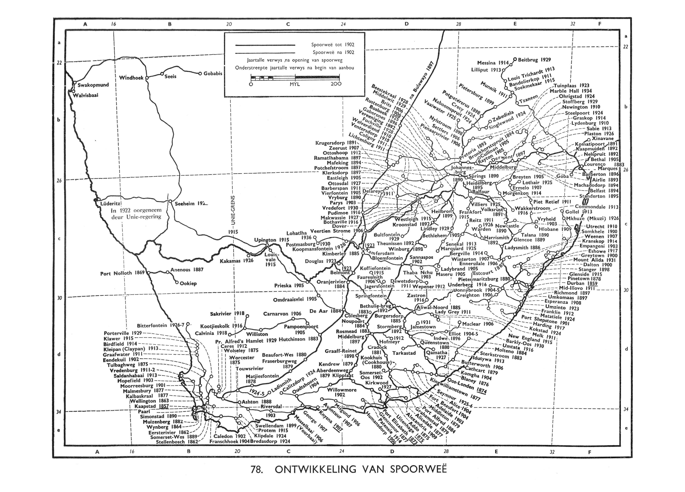

<!-- maketile -->
\begin{center}
\Large\scshape{Commodity Prices in the Cape Colony, 1889-1914} \\ 
\vspace{1em}
\large\normalfont{Laurie Binge}\footnote{PhD candidate at the Department of Economics at Stellenbosch University.} \\
\large\normalfont{Willem H. Boshoff}\footnote{Associate Professor at the Department of Economics at Stellenbosch University.} \\
\normalsize\textit{Stellenbosch University} \\
\normalsize\normalfont{This draft: \today} 
\end{center}
\begin{small}

The turn of the 20th century was a period of huge structural change in South Africa. This paper attempts to make a specific contribution to the quantitative history of the Cape Colony for the period 1889-1914. This is an interesting period of South African history, between the discovery of gold in the Witwatersrand (1886) and the outbreak of WWI (1914). The aim is to create historical monthly wholesale price indices for agricultural commodities in the Cape Colony, using the repeat sales method. The wholesale price indices display a relatively strong cyclical trend, which accords quite well with the historical narrative on the economic history of the Cape Colony. The prices are also used to analyse market integration over this period. The results indicate that there was increased market integration in the Cape Colony after the War, which corresponds to the period of rapid expansion of the branch railway lines.

\vspace{0.5em}
\noindent{\textbf{JEL Classification:} N57, N97, C43} \\
\noindent{\textbf{Keywords:} Cape Colony, Commodity Price Index, Repeat Sales}
\end{small}
\renewcommand{\thefootnote}{\arabic{footnote}}

#Introduction
The turn of the 20th century was a period of huge structural change in South Africa. The discovery of gold in 1886 on the Witwatersrand fundamentally altered the structure of the economy from essentially pastoral to mining-intensive. The Second South African War (1899-1902) fundamentally altered the region, and led to the formation of the Union of South Africa from the four colonies in 1910. 

The seminal works of @DeKock1924, @Schumann1938 and @DeKiewiet1941 discuss the economic and social history of the period. More recently, there has been what @Fourie2016 calls a Data Revolution in African Economic History. Over the past two decades the increase in access to online resources, data-processing software and computing power has enabled scholars to capture and analyse historical statistics on a much larger scale than before. Archival records from the colonial era are being digitised and transcribed on a much larger scale. One example is the Colonial Blue Books, a large collection of reports containing records of government revenue and expenditure, imports and exports, and a range of other statistics. These data sources can now be used to study a variety of issues, including population size, wages, incomes, education, fiscal systems, and transport networks of African societies. A range of studies have investigated this interesting period using newly digitised historical data (see, for instance, @Boshoff2015, @Greyling2015 and @DeZwart2011). 

This paper attempts to make a specific contribution to the quantitative history of the Cape Colony over this period. The aim is to create a high-frequency (i.e. monthly) wholesale price index for agricultural commodities for the Cape Colony for the period 1889-1914. This is a particularly interesting period of South African history, between the discovery of gold in the Witwatersrand in 1886 and the outbreak of WWI in 1914.  Higher-frequency price indices are essential in studying business cycles, financial crises and market behaviour in general. The intention is to provide some insight into the price history of selected episodes in South African economic and financial history. 

The index is based on two new datasets that have been digitised and transcribed. The first is a dataset of monthly market prices of agricultural products in various towns reported in the Agricultural Journals of the Department of Agriculture. The second is a dataset of annual market prices of agricultural products in various towns reported in the Cape Colony Blue Books. 

The challenge in creating monthly wholesale price indices based on these datasets is that the monthly data is incomplete, both in terms of the coverage of products and towns, and in some cases Journal volumes that are missing altogether. @Klovland2014a showed that the repeat sales method, which is typically used in creating indices for infrequently traded goods such as real estate, may be used to deal with incomplete data in the context of constructing a relatively high-frequency historical price index for commodities. The repeat sales method provides a consistent way to aggregate the price data and produces indices with substantially fewer gaps than there are in the individual series.

This paper will apply the repeat sales method to estimate historical commodity price indices for the Cape Colony for the period 1889-1914. The annual prices from the Blue Books are also incorporated to supplement the monthly price information. This is particularly useful because the Agricultural Journals omit a number of important products altogether, and still contain substantial gaps for a number of products, even after the repeat sales method has been implemented. 

By aggregating information from these two sources, wholesale indices are computed for each product. The product indices are then aggregated to form indices of broader product groups, as well as an overall wholesale commodity price index. The benchmark weightings are based on production and import values reported in the 1904 census. The wholesale price indices display a relatively strong cyclical trend, which accords quite well with the historical narrative on the economic history of the Cape Colony. To gauge if they provide reasonable results, the estimated monthly wholesale price indices are compared to existing consumer price indices for the Cape Colony and to wholesales price indices for the UK. The estimated wholesale indices seem plausible, although they exhibit a stronger cyclical trend than the available CPIs.

The history of prices may be a useful starting point for further analysis of issues in macroeconomic and financial history, as well as price convergence or market integration. In one such application, the indices are used to analyse market integration over this period, when the mineral discoveries led to the substantial development of transport infrastructure and especially the railways. To this end the two datasets are aggregated in a slightly different way, using the same techniques. Market integration is investigated by comparing the price indices for specific commodity groups in the different towns in the Colony. Although the evidence necessarily imperfect, the results indicate that there was increased market integration in the Cape Colony after the War, which corresponds to the period of rapid expansion of the branch railway lines.

```{r readdata, echo=FALSE, results='hide', message=FALSE, warning=FALSE, cache = TRUE}
##=====================##
## READING IN THE DATA ##
##=====================##
suppressMessages(library(zoo))           
suppressMessages(library(ggplot2))
suppressMessages(library(plyr))
suppressMessages(library(dplyr))
suppressMessages(library(reshape2))
suppressMessages(library(stargazer))
suppressMessages(library(micEcon))
suppressMessages(library(quantreg))
suppressMessages(library(McSpatial))
suppressMessages(library(quantmod))
suppressMessages(library(xtable))
suppressMessages(library(scales))
suppressMessages(library(tseries))
suppressMessages(library(urca))
suppressMessages(library(lmtest))
suppressMessages(library(grid))
suppressMessages(library(tempdisagg))

setwd("C:\\Users\\Laurie\\OneDrive\\Documents\\BING\\Commodity Cycles\\R Commodities")

GDP <- read.csv("GDP.csv", header=TRUE, sep=",",na.strings = "", skipNul = TRUE)
GDP$Date <- as.Date(GDP$Date)

##For Graphing Business cycles
recessions.df = read.table(textConnection(
    "Peak, Trough
    1862-01-01, 1864-01-01
    1869-01-01, 1870-01-01
    1873-01-01, 1874-01-01
    1877-01-01, 1879-01-01
    1881-01-01, 1886-01-01
    1893-01-01, 1896-01-01
    1899-01-01, 1902-01-01
    1905-01-01, 1909-01-01"), sep=',',
    colClasses=c('Date','Date'), header=TRUE)
```

#The Economic History of the Cape Colony
The seminal works of @DeKock1924, @Schumann1938 and @DeKiewiet1941 discuss the economic and social history of the South African colonies in the late 19th and early 20th centuries. These studies have similar narratives of the economic development of South Africa around that period. More recently, @Greyling2015 calculated GDP estimates for the Cape Colony, in order to facilitate the analysis of long-term growth and development in the Colony. This section provides a brief description of the economic history of the period (i.e. GDP growth, inflation, imports and exports), by synthesising the historical narratives and relating them to the quantitative evidence from the GDP estimates. 

Figure 1 illustrates the real GDP estimates for the Cape Colony (1956-1909) reported in @Greyling2015, with recessionary periods shaded. They derived the business cycle by decomposing the GDP series into its cyclical and trend components, using the Baxter-King band-pass filter. An upswing phase was defined as a period when real GDP was higher than trend GDP and a recession as a period when real GDP lower than trend GDP. The turning points should be taken as indicative, as there are many ways to extract the business cycle, which would lead to slightly different turning point dates.[^3] 

[^3]: Wimpie, ons moet miskien self die business cycle derive met 'n ander metode soos die Christiano-Fitzgerald method (mens sou ons dit selfs maadeliks kon doen met interpolasie). Dit sal dalk datums gee wat meer ooreenstem met die historiese bronne en die wholesale price indices.

```{r figure1, echo=FALSE, warning=FALSE, cache = TRUE, fig.height=4.5, fig.width=7.5, fig.cap="Real GDP in the Cape Colony (1956-1909)"}
indicator_plot <- GDP[,c("Date","lnRGDP")]
g <- ggplot(indicator_plot) 
g <- g + theme_bw()
g <- g + labs(color="Legend text")
g <- g + geom_line(aes(x=Date, y=lnRGDP, colour="lnRGDP"), size = 1)
g <- g + geom_rect(data=recessions.df, aes(xmin=Peak, xmax=Trough, ymin=-Inf, ymax=+Inf), fill='grey', alpha=0.5)
g <- g + ylab("log Real GDP")
g <- g + xlab("")
g <- g + theme(axis.text.x=element_text(angle=90,hjust=1,vjust=0.5))
g <- g + scale_x_date(labels = date_format("%Y"),breaks = date_breaks("year"))
g <- g + theme(legend.position="none")
g
```

The focus here is on the last two decades of the period, between the discovery of gold in 1886 and the formation of the Union in 1910. Taken as a whole the Cape Colony experienced relatively rapid expansion over this so-called "gold-mining" period, during which the structure of the economy transformed from an agricultural economy to an agricultural-mineral economy [@Schumann1938]. According to the GDP estimates, the Cape Colony experienced three upswing phases and three downswing phases between 1886 and 1909, with the most severe recession during the Second South African War (1899-1902). 

According to the GDP estimates, the discovery of gold was followed by an upswing phase, lasting roughly from 1886 to 1892. According to the historical sources [@Schumann1938 and @DeKock1924], the upswing phase was followed by a depression as the result of a speculative financial and banking crisis in 1889-1890. The banking crisis was due to an overextension of credit, and speculation in gold shares and property. Most of the local or district banks in the Cape got into financial difficulties and were absorbed by the larger banking institutions [@DeKock1924]. The price of gold shares, land and prospecting firms plummeted, while railway traffic, government revenue and imports declined marginally [@Greyling2015]. The crisis was intensified by the Baring crisis of 1890 in England. However, @Schumann1938 reports that the effect on the banks of the Cape was much more severe than on economic conditions in general. Agriculture in the Cape Colony did not suffer from the depression immediately, as the harvest prospects for 1890 were excellent. This is reflected in the flat real GDP figures from 1890 to 1893, when a peak was reached. 

The recession lasted from 1893 to 1896 according to the GDP estimates. Political and natural factors contributed to the relatively stagnant period [@Gilbert1933]. The Jameson Raid at the end of 1895 had an unsettling effect on business conditions. Tensions between the Boer Republics and Britain led to the closure of the drifts in September and October 1895, disrupting road transport of goods into the interior and outward to the coastal ports. A severe drought in 1896 and the rinderpest cattle disease caused widespread livestock losses, especially in the interior [@Schumann1938; @DeKock1924].

According to the turning point dates, there was a mild recovery between 1896 and 1899, although GDP was still relatively stagnant. As the country was slowly emerging from this crisis, the outbreak of the Second South African War (1899-1902) caused a severe recession. The War had a devastating effect on the economies of the Boer Republics. Agricultural prospects were severely hampered following the "scorched earth" policy of the British forces. This policy caused destruction of farm buildings, crops and livestock in the Transvaal and the Orange Free State, and to a lesser extent in parts of the Cape Colony and Natal. Gold mining in the Transvaal came to an almost complete standstill until 1902, with the value of gold production declining from £16m in 1898 to £1m in 1901 [@Schumann1938]. 

The huge increase in expenditure by the British Government in connection with military operations created prosperity in parts of the Cape Colony and Natal, especially amongst the farming and trading communities. The War cost Great Britain around £250 million, of which a large proportion was spent in the Cape Colony and Natal to purchase agricultural and pastoral produce for the troops. Within a few months of the outbreak the War, the number of British soldiers in South Africa increased to 130,000, and subsequently to around 250,000 (nearly 25% of the white population of the four territories combined) [@Schumann1938].

The War demand for goods and services stimulated increases in prices and production [@DeKock1924]. Due to the increased local demand for produce, exports from Cape and Natal ports declined considerably, from almost £25m in 1898 to £7.5 in 1900. Figure 2 illustrates the decrease in exports, as well as the marked increase in imports from 1899 to 1903, due in large part to the increased imports of military supplies for the British troops [@Gilbert1933]. British military expenditure on around 250,000 soldiers therefore provided an injection for consumption and production in the Cape Colony and Natal [@Greyling2015]. According to the Cape Colony GDP estimates, the trough was reached already in 1900, which was followed by a relatively swift recovery.

```{r figure2, echo=FALSE, warning=FALSE, cache = TRUE, fig.height=4.5, fig.width=7.5, fig.cap="Total Imports and Exports in the Cape Colony (1986-1909)"}
trade <- read.csv("Trade.csv", header=TRUE, sep=",",na.strings = "", skipNul = TRUE)
trade$Date <- as.Date(trade$Date)

##For Grpahing Business cycles
recessions.df = read.table(textConnection(
    "Peak, Trough
    1893-01-01, 1896-01-01
    1899-01-01, 1902-01-01
    1905-01-01, 1909-01-01"), sep=',',
    colClasses=c('Date','Date'), header=TRUE)

indicator_plot <- trade[,c("Date","Imports","Exports","Trade_Balance")]
g <- ggplot(indicator_plot) 
g <- g + theme_bw()
g <- g + labs(color="Legend text")
g <- g + geom_line(aes(x=Date, y=Imports, colour="Imports"), size = 1)
g <- g + geom_line(aes(x=Date, y=Exports, colour="Exports"), size = 1)
#g <- g + geom_bar(aes(x=Date, y=Trade_Balance, fill="Trade_Balance"),size = 0.5,stat="identity")
g <- g + geom_rect(data=recessions.df, aes(xmin=Peak, xmax=Trough, ymin=-Inf, ymax=+Inf), fill='grey', alpha=0.5)
g <- g + xlab("")
g <- g + theme(axis.text.x=element_text(angle=90,hjust=1,vjust=0.5))
g <- g + scale_x_date(labels = date_format("%Y"),breaks = date_breaks("year"))
g <- g + theme(legend.title=element_blank()) + theme(legend.position="bottom")
g <- g + scale_y_continuous(name="Value (pounds)", labels = comma)
g
```

The end of the War in 1902 was followed by an upswing phase. According to @Schumann1938, the post-war boom was mainly the result of a general feeling of optimism, both in England and in South Africa, after the conclusion of the War. This optimism resulted in the extension of bank credit and extensive speculation in property, as well as an increase in the importation of capital and goods to aid reconstruction. The reconstruction schemes, including a development loan of £3 million granted by the British Government, stimulated economic activity and a speculative environment [@DeKock1924]. Exports also increased significantly as the War, as did immigration, presumably in search of mineral wealth. 71,081 people landed at Cape ports in 1903, compared to 27,192 by 1908 [@Gilbert1933].

However, the post-war boom was short-lived. According to the GDP estimates, recession set in by 1905, although historical sources put the date slightly earlier in 1903. According to @Schumann1938, the depression was caused by a cyclical reaction to the large economic disequilibrium. Production expanded after the War, based on the expected expansion of gold and other industries. Despite the relatively early return to gold production, the progress of the gold industry was hampered by the lack of an adequate supply of unskilled labour after the War. The inflow of purchasing power due to the War ended and large stocks of military goods were sold. When the expectations of growth were not fully realised, a long period of depression followed [@DeKock1924]. The depression may in part be explained by the complete destruction of the interior [@Greyling2015]. The financial panic in Europe and America in 1907 and its effects on South African trade, as well as the drought of 1908, may also have deepened the depression [@DeKock1924].

The depression seems to have lasted up to 1910, the year of the Unification of the four territories [@Schumann1938]. The subsequent recovery period seems to have taken place up to the outbreak of WWI in 1914 (the end of the sample period).[^4] @DeKock1924 [127] called this the period of economic reorganisation, with an expansion in the agricultural, pastoral and manufacturing industries.

[^4]: Wimpie, dit sou ideal wees om die GDP estimates vir die Kaapkolonie tot by 1914 te vat en dan die description van hierdie section uit te brei. Ons sal net moet uitvind of dit beskikbaar is. Anders kan ek miskien net stukke uit Schumann (1938) en De Kock (1924) gebruik om die prentjie te voltooi.

Overall, the turn of the 20th century was a turbulent period of South African history. Globalisation and the discovery of minerals transformed the Cape Colony into a prosperous exporting region with a steadily increasing GDP [@Fourie2015a]. The largest single economic event over the sample period (1889-1914) seems to have been the Second South African War (1899-1902). The following section provides a brief description of the War period.

##The Second South African War (1899-1902)
The Second South African War (1899-1902), or Anglo-Boer War, was fought between Britain on the one side, with its two colonies (the Cape Colony and Natal), and the two independent Boer Republics (the South African Republic or Transvaal and the Orange Free State) on the other. It proved to be the longest (almost 3 years), costliest (over £200 million), bloodiest (estimates vary between 59,000-68,000 lives), and most humiliating colonial war for Britain between 1815 and 1914 [@Packenham1979]. @Marks2011 argues that the War as important in shaping modern South Africa as the American Civil War was for the United States. 

After the discovery of the gold deposits on the Witwatersrand, immigrants (labelled *Uitlanders*) poured into the Transvaal. The tensions around the franchise of the *Uitlanders*, many of who were of British origin, became the main source of conflict between the Transvaal and British Governments and ostensibly the cause of the War. However, there were also wider considerations relating to the powerful financial interests centred on the control of the gold mines [@Marks2011]. Factors such as the Jameson Raid, *Uitlander* grievances, monopolies, and tariffs were directly connected with gold mining interests. Any attempt by the British Government to secure concessions from the Transvaal Government made it the agent of the mining magnates [@DeKiewiet1941]. Moreover, Britain was pursuing its lengthy quest for a united South Africa [@DeKiewiet1941] and its need to assert itself in the face of economic competition from America and Germany [@Marks2011]. 

War was declared by the Boer Republics on 11 October 1899, after the expiry of President Kruger's ultimatum to the British government to withdraw all their troops from the border of the Transvaal. Kruger had hoped for a short war, like the clash with Britain in 1881, when the British quickly gave up the fight. This time round a long drawn-out war ensued, with numerous unforeseen consequences [@Fourie2015]. 

Within a year the British captured the capitals of the two Republics, Bloemfontein (on 13 March 1900) and Pretoria (on 5 June 1900), without meeting much resistance [@Fourie2014]. Contrary to expectations, however, this did not signal the end of the War. There were too many areas still not under British control and the line of communication through the Orange Free State was poorly guarded and vulnerable [@Pretorius1998]. Hostilities lasted for another two years. Giving up on the impossible objective of trying to halt the British advance, Boer commando forces switched to guerrilla tactics [@Pretorius1998]. Moving in mobile commandos, Boer soldiers launched running attacks on British columns and supply lines [@Marks2011] and strategically intercepted British outposts and deliveries over the vast Highveld terrain [@Fourie2014]. 

The British responded with a threefold strategy to end the War, involving block houses, intensifying the scorched earth policy and the use of concentration camps. Block houses were erected to protect strategic points such as bridges and railways, and as barriers to limit the free movement of the Boers across the countryside. The scorched earth policy involved the destruction of homesteads, burning of crops and foodstuffs and the slaughtering of livestock. Boer women and children were then sent concentration camps [@Fourie2014]. These soon became notorious, as insanitary conditions, poor rations and overcrowding led to major epidemics and high mortality rates. Thousands of displaced Africans, too, were rounded up and put into segregated concentration camps, many of which also served as labour depots for the British army [@Marks2011]. 

By 1902 the Republics had been ground down by the large resources of the British army, the destruction of farms, the high death rates among women and children in the concentration camps, and the increasingly tight British control of the countryside through blockhouses and barbed wire [@Marks2011]. The Boer leadership was forced to sue for peace, and on 31 May 1902 the Peace Treaty of Vereeniging was signed [@Pretorius1998]. At the signing of the peace the British Government promised £3million towards rehabilitating the Transvaal and the Orange Free State.

Estimates of the mortality rates vary, but it is estimated that at least 22,000 British and 7,000 Boer soldiers died. More than 27,000 Boer women and children died in the concentration camps (out of the 118,000 inmates). An estimated 12,000 black South Africans, who fought in large numbers on both sides, lost their lives, although these estimates are less precise [@Fourie2014]. Recent estimates suggest that African camp mortality rates may have been even higher than in the Boer camps [@Marks2011].

For the purposes of movements in commodity prices, two factors were especially important over this period. From the demand side, the War involved a massive influx of British troops. In 1897, there was at most 10,000 British troops within the Cape Colony [@Evans2000]. By 1900, the British had shipped in massive reinforcements for a counteroffensive against the Republics. By the end of the war, almost 450,000 British regulars and colonial forces had been involved in the war (although all were not necessarily present at any given time), compared to an estimated 88,000 Boer and volunteer forces [@Fourie2014]. The size of the invading army was as large as the combined white citizenry of the Republics [@Marks2011].

From the supply side, the scorched earth policy led to the systematic devastation of the Republics [@Pretorius1998]. The policy started as specific reprisals for Boer attacks, whereby farms in the vicinity of attacks would be burnt. In September 1900 the policy was extended to the destruction of all farms and food supplies within 16km of an incident, or if a farm had been used as a commando base. In December 1900, the land clearance policy was intensified in order to deny support to Boers in the field. Over the course of the war some 30,000 houses, including farms, were burned down or extensively damaged [@Evans2000]. The onslaught on the Boers means of survival was intensified by the destruction of all food supplies. Livestock was killed in enormous numbers, and fields of grain and maize burned. The devastation in the two Republics led to subsequent food shortages [@Pretorius1998]. 

Moreover, trade between the territories had all but collapsed with the outbreak of the War. For example, according to the Report on the Customs Transactions of the Colony for 1899 (in the Blue Books) the conflict paralysed trade between the Cape Colony and the two Boer Republics and was seriously interfering with trade with the northern districts of the Cape Colony. Indeed, all trade was suspended between the Cape Colony and the Boer Republics on the 12th October 1899, and a Proclamation (No. 277) was issued, prohibiting such trade. 

The Report on the Customs Transactions of the Colony for 1900 reported that the huge increase in imports into the Cape Colony was could be attributed to the large number of immigrant residents, expenditure on troops en route, and the restricted production of food stuffs in the districts affected by War. One might expect these developments to lead to an increase in agricultural commodity prices around the War period. The two new datasets, introduced in the following section, provides a way of investigating these developments. 

#The Data
The major aim of the paper is to estimate a monthly historical commodity price index for the Cape between 1889 and 1914. The choice of period is constrained by the availability of high-frequency data. The wholesale commodity price indices presented below are based on two new datasets that have been digitised and transcribed.[^5]

[^5]: All prices were reported in pounds sterling (£), shillings (s) and pennies (d) and converted to pennies. There were twenty (20) shillings (s) per pound (£). The shilling (s) was subdivided into twelve (12) pennies (d). 

The first dataset reports the monthly "*Current Market Rates (Wholesale) of Agricultural Produce*", as telegraphed by the Civil Commissioners and reported in the Agricultural Journals of the Department of Agriculture of the Cape Colony (available in the Elsenburg library). The Journals are available from October 1889 to August 1914, which dictates the period that the indices will cover. Monthly data are available for 24 different commodities (e.g. wheat, eggs and tobacco)[^6] in 20 towns across the Cape Colony (e.g. Cape Town, Kimberley and Port Elizabeth).[^7] 

[^6]: The 24 products are wheat, wheat flour, boer meal, mealies, mealie meal, barley, oats, oathay, lucerne hay, potatoes, tobacco (boer roll), beef, mutton, fresh butter, eggs, cattle (slaughter), sheep (slaughter), pigs (slaughter), bread, oranges, saddle-horses, transport oxen, milch cows, woolled sheep.
	
[^7]: The 20 Cape Colony towns are: Aliwal North, Beaufort West, Burghersdorp, Cape Town, Clanwilliam, Cradock, Dordrecht, East London, Graaff-Reinet, Graham's Town, Kimberley, King William's Town, Malmesbury, Mossel Bay, Port Alfred, Port Elizabeth, Queen's Town, Tarkastad, Vryburg and Worcester. The data also includes a few prices for towns in the other territories (e.g. Johannesburg) in the final few months of the sample. Unfortunately, these are too few to include in the indices.

Figure 3 illustrates the number of monthly observations by commodity. Clearly the sample suffers from missing data points. Not only do a number of commodities and towns disappear from the recorded sample, but certain volumes of the Agricultural Journals are missing altogether.[^8] The increase in observations around the turn of the century is due to the fact that weekly prices were recorded over that period. 

[^8]: The missing volmues are: Jan97-Jun97, Sep97, Jul98-Dec98, Jan00-Jun00, Jul02-Aug02, Apr05-May05, Aug05, Jul06-Jun07, Nov08, Jul09-Dec09, Apr10-May10, and Jan11-Feb12.

```{r comdata, echo=FALSE, results='hide', message=FALSE, warning=FALSE, cache = TRUE}
comdata <- read.csv("Commodities.csv", header=TRUE, sep=",",na.strings = "", skipNul = TRUE)
#comdata$date <- as.Date(comdata$date, "%Y/%m/%d")
comdata$datum <- paste(comdata$datum, comdata$Year)
comdata$date <- as.Date(as.yearmon(as.character(comdata$datum),"%B %Y"))
comdata$datum <- factor(as.yearmon(as.character(comdata$datum),"%B %Y"))
#-------------------------------------------------------------------
wc.towns <- c("Beaufort West","Bredasdorp","Caledon","Cape Town","Ceres","Clanwilliam",
              "George","Knysna","Ladismith","Malmesbury","Mossel Bay","Oudtshoorn","Paarl","Piquetberg",
              "Prince Albert","Riversdale","Robertson","Stellenbosch","Swellendam","Tulbagh","Uniondale",
              "Worcester","Van Rhyn's Dorp","Wynberg")
ec.towns <- c("Albany","Albert","Aliwal North","Burghersdorp","Cradock","Dordrecht","East London","Graaff-Reinet",
              "Graham's Town","Humansdorp","King Williams Town","King William's Town","Middelburg",
              "Port Alfred","Port Elizabeth","Queen's Town","Somerset East","Tarkastad","Uitenhage","Willowmore",
              "Mount Currie","Kokstad","Umtata")
nc.towns <- c("Colesberg","Kimberley","Philipstown","Richmond")
kzn.towns <- c("Pietermaritzburg, Natal","Durban, Natal")
in.towns <- c("Bloemfontein","Bulawayo","Johannesburg","Pretoria","Salisbury","Vryburg")
cape <- c(wc.towns,ec.towns,nc.towns)
col.towns <- c(cape,kzn.towns)
all.towns <- c(wc.towns,ec.towns,nc.towns,kzn.towns,in.towns)

comdata <- comdata[comdata$town %in% cape,]
#-------------------------------------------------------------------
coms <- aggregate(comdata$wheat, by=list(comdata$date), FUN = function(x) sum(!is.na(x)))
for(i in colnames(comdata)[7:29]) {
    coms1 <- aggregate(comdata[,i], by=list(comdata$date), FUN = function(x) sum(!is.na(x)))
    coms <- merge(coms, coms1, by="Group.1",all.x=TRUE)
}
colnames(coms) <- c("Date",colnames(comdata)[6:29])
rm(coms1)
```

```{r figure3, echo=FALSE, warning=FALSE, cache = TRUE, fig.height=4.5, fig.width=7.5, fig.cap="Total the number of monthly observations by commodity"}
suppressMessages(library(grid))
complot <- melt(coms, id="Date") 
complot$value[complot$value=="0"] <- NA
g <- ggplot(complot, aes(x=Date,value,colour=variable,fill=variable))
g <- g + geom_bar(stat="identity")
g <- g + theme(legend.title=element_blank())
g <- g + ylab("Total observations")
g <- g + theme(legend.key.size = unit(0.4,"cm"))
g <- g + theme(axis.text.x=element_text(angle=90,hjust=1,vjust=0.5))
g <- g + scale_x_date(labels = date_format("%Y"),breaks = date_breaks("year"))
g
```

Figure 4 illustrates the monthly prices for one of the commodities, wheat, by Cape Colony town. Wheat prices varied widely over the period, especially around the turn of the 20th century. The challenge is to combine these time series in a consistent way in order to construct a coherent index of monthly wheat prices for the Cape Colony.

```{r rscomdata, echo=FALSE, results='hide', message=FALSE, warning=FALSE, cache = TRUE}
#-----------------------
#Repeat Sales Sample
#-----------------------
rscomdata <- comdata[,c("time_id","date","town","wheat")]
rscomdata$commodity <- "wheat"
colnames(rscomdata) <- c("counter","date","town","price","commodity")
for(i in colnames(comdata)[7:29]) {
    rscomdata1 <- comdata[,c("time_id","date","town",i)]
    rscomdata1$commodity <- i
    colnames(rscomdata1) <- c("counter","date","town","price","commodity")
    rscomdata <- rbind(rscomdata, rscomdata1)
}
rscomdata$lnprice <- log(rscomdata$price)
rscomdata <- transform(rscomdata, id = as.numeric(interaction(factor(town),factor(commodity),drop=TRUE)))
```

```{r figure4, echo=FALSE, warning=FALSE, cache = TRUE, fig.height=4.5, fig.width=7.5, fig.cap="Monthly wheat prices by town - Agricultural Journals"}
suppressMessages(library(grid))
rscomdata1 <- rscomdata[rscomdata$commodity=="wheat",]
g <- ggplot(data=rscomdata1,aes(x=date, y=price, colour=town)) 
g <- g + geom_point(size = 0.5) 
g <- g + geom_line()
g <- g + ylab("Wheat prices")
g <- g + xlab("")
g <- g + theme(legend.key.size = unit(0.5,"cm"))
g <- g + theme(axis.text.x=element_text(angle=90,hjust=1,vjust=0.5))
g <- g + theme(legend.title=element_blank())
g <- g + scale_x_date(labels = date_format("%Y"),breaks = date_breaks("year"))
g
```

The second dataset reports annual market prices in the Colonial Blue Books of the Cape Colony (available from the British Online Archives), available from 1889 to 1907. The annual market prices in Colonial Blue Books were collected by the colonial administrators in South Africa and sent to the Colonial Office in London [@DeZwart2011]. This information on "Average Market Prices of Agricultural Produce,"[^9] "Provisions,"[^10] and "Stock and Animal Productions"[^11] were used to create a database that includes prices of 50 agricultural products in 48 towns.[^12] In a few cases there were more than one series for a specific commodity, such as three different series for wine (ordinary quality, better quality and wine without a description) and two series for beer (English and Colonial).

[^9]: Wheat, barley, rye, oats, mealies, peas & beans, potatoes, pumpkins, aloes, argol, wine and brandy.

[^10]: Oatmeal, flour, bread, mutton, beef, pork, bacon, butter, cheese, tea, coffee, sugar, rice, tobacco, dried fruit, salt, wine, brandy, beer, milk, candles, and lamp oil.

[^11]:  Saddle horse, draught mules, asses, draught oxen, milch cows, woolled sheep, cape sheep, swine, goats, fowls, ducks, washed wool, fat and tallow, soap, hides, sheep skins, and goat skins.
	
[^12]: The 48 Cape Colony towns are: Albany, Albert, Aliwal North, Beaufort West, Bredasdorp, Caledon, Cape Town, Ceres, Clanwilliam, Colesberg, Cradock, East London, Fort Beaufort, George, Glen Grey, Graaff-Reinet, Humansdorp, Kimberley, King Williams Town, Knysna, Ladismith, Malmesbury, Middelburg, Mossel Bay, Oudtshoorn, Paarl, Philipstown, Piquetberg, Port Elizabeth, Prince Albert, Queen's Town, Richmond, Riversdale, Robertson, Somerset East, Stellenbosch, Swellendam, Tulbagh, Uitenhage, Uniondale, Willowmore, Worcester, Van Rhyn's Dorp, Wynberg, Mount Currie, Kokstad, Umtata.

The annual data is also incomplete in terms of the coverage of products and towns. Figure 5 illustrates the annual prices for wheat by town. Again, wheat prices seem to have varied widely between towns in the Cape Colony over the sample period. 

```{r bluedata, echo=FALSE, results='hide', message=FALSE, warning=FALSE, cache = TRUE}
##=================##
## BLUE BOOKS DATA ##
##=================##
blue <- read.csv("Blue_Books.csv", header=TRUE, sep=",",na.strings = "", skipNul = TRUE)
blue <- blue[blue$town!="Walfish Bay",]

rsblue <- blue[,c("date","town","oatmeal")]
rsblue$commodity <- "oatmeal"
colnames(rsblue) <- c("date","town","price","commodity")
for(i in colnames(blue)[4:62]) {
    rsblue1 <- blue[,c("date","town",i)]
    rsblue1$commodity <- i
    colnames(rsblue1) <- c("date","town","price","commodity")
    rsblue <- rbind(rsblue, rsblue1)
}
rsblue$lnprice <- log(rsblue$price)
rsblue <- transform(rsblue, id = as.numeric(interaction(factor(town),factor(commodity),drop=TRUE)))
```

```{r figure5, echo=FALSE, warning=FALSE, cache = TRUE, fig.height=4.5, fig.width=7.5, fig.cap="Annual wheat prices by town - Blue Books"}
suppressMessages(library(grid))
rsblue1 <- rsblue[rsblue$commodity=="wheat",]
g <- ggplot(data=rsblue1,aes(x=date, y=price, colour=town)) 
g <- g + geom_point(size = 1) 
g <- g + geom_line()
g <- g + ylab("Wheat prices") + xlab("")
g <- g + theme(legend.text=element_text(size=9))
g <- g + theme(axis.text.x=element_text(angle=90,hjust=1,vjust=0.5))
g <- g + theme(legend.title=element_blank())
g
```

In some cases the commodity and town series in the two datasets overlap, although they are almost always reported in different units. This means that the trends can be compared, even though the levels are different. Figure 6 illustrates the case of wheat prices in Cape Town. In the monthly dataset wheat prices are reported in pounds (lbs), whereas in the annual data the wheat prices are reported per bushel. The average prices reported in the two datasets seem to capture a similar trend over time, as one would expect.  

```{r figure6, echo=FALSE, warning=FALSE, cache = TRUE, fig.height=4.5, fig.width=7.5, fig.cap="Wheat prices in Cape Town"}
rscomdata1 <- rscomdata1[rscomdata1$town=="Cape Town",]
rsblue1 <- rsblue1[rsblue1$town=="Cape Town",]
rsblue1$date <- paste(rsblue1$date,"-12-01",sep="")
rsblue1$date <- as.Date(rsblue1$date)

wheat <- merge(rscomdata1[,c(2,4)],rsblue1[,c(1,3)],by.x="date",by.y="date",all.x=TRUE)
wheat <- wheat[1:325,]
colnames(wheat) <- c("date","Wheat per 100lbs (Agri Journals)","Wheat per bushel (Blue Books)")
complot <- melt(wheat, id="date") 

g <- ggplot(data=complot,aes(x=date, y=value, colour=variable)) 
g <- g + geom_line()
g <- g + geom_point(aes(size = variable)) 
g <- g + ylab("Wheat prices")+ xlab("")
g <- g + theme(axis.text.x=element_text(angle=90,hjust=1,vjust=0.5))
g <- g + theme(legend.title=element_blank()) + theme(legend.position="bottom")
g
```

The challenge is to combine and aggregate these two sets of prices in a consistent way in order to create coherent price indices of agricultural commodities for the Cape Colony. This is complicated by the fact that there are so many missing values in both panels. The following section presents the methodology suggested to tackle these challenges.

#Methodology
##Price indices
Higher-frequency price indices are useful in studying business cycles, crises and market behaviour in general. The first generation of historical price indices, such as @Jevons1865 and @Giffen1879, were focused on the influence of the supply of precious metals (typically gold) on the variation in the general price level. @Gilbert1933 followed this tradition in his analysis of the economic effects of gold discoveries on South Africa, using an annual weighted aggregated index of the prices of 13 foods for 1883-1907. Another strand of the literature, which includes @Persons1921 and @Silberling1923, focused on the measurement of business cycles or "*business conditions during alternating periods of prosperity and depression.*" The seminal work of @Schumann1938 on business cycles in South Africa follows this tradition. He constructed a quarterly wholesale price index from 1910-1936 used in this analysis. 

The primary aim is to use these two datasets of market prices to construct a monthly historical commodity price indices for the Cape Colony from 1889 to 1914. As far as the author is aware no such commodity price index exists for the Cape Colony over that period. The brief review of the data sources showed that the price series were extracted from publications that were incomplete and in some cases just missing. This is a common occurrence, as many historical price series must be extracted from publications which are incomplete and in some cases no longer accessible. Even if sources are available on a continual basis there will inevitably be cases when a particular data series has been discontinued or contains substantial gaps. The supply of agricultural commodities may vary according to seasonal factors and occasional crop failures, creating gaps in the price series. Coverage may deteriorate during periods of conflict or war. Quality descriptions and publication practices may also change over time. These problems make it challenging to combine price data to form continuous time series [@Klovland2014a].

The traditional way of dealing with the problem of gaps in historical data is to splice the time series at a point in time when there is overlapping information (see for instance @Solar2011). This method requires great care and involves substantial work. If there are many time series and various gaps in the data, as is often the case with higher frequency historical data, this procedure may become very difficult to implement consistently [@Klovland2014a].

@Klovland2014a recommended that the repeat sales method could be useful whenever underlying series were characterised by incomplete observations. The repeat sales method was specifically developed for a market where the price of each object is quoted infrequently and at irregular intervals, which is typical in the real estate market. A similar, albeit less extreme, situation is typical of historical price data, where the gaps between the observed prices are usually shorter. The problems encountered in aggregating the individual time series to an overall index are in principle the same. One can think of each commodity price series as a specific item (e.g. a property or an artwork). The repeat sales approach compares the price of that same item over time, with a sale occurring whenever a data point is observed. 

##Repeat Sales Method
The repeat sales method was initially proposed by @Bailey1963 to calculate house price changes. They saw their procedure as a generalisation of the chained matched model methodology applied previously in the construction of real estate price indices. The method was subsequently extended by @Case1987, among others, and is currently used to produce the S&P/Case-Shiller Home Price Indices in the US.

The repeat sales method tracks the sale of the same item over time. It aggregates sales pairs and estimates the average return on the set of commodities in each period [@Kraussl2010]. The index numbers are derived directly from a least squares regression involving a set of dummy variables and requiring only information on the rate of change of the individual price series and the dates at which the data are observed [@Klovland2014a].

Following @Wang1997, the model underlying the method in @Bailey1963 may be derived in the following manner. Where $t_1$ and $t_2$ are the times of the first and second transactions, a price relative $\frac{P_{i,t_2}}{P_{i,t_1}}$ can be modelled as:
$$\frac{P_{i,t_2}}{P_{i,t_1}} = \frac{I_{t_2}}{I_{t_1}} \times u_{i,t} , $$
where $P_{it}$ is the price of commodity $i$ at time $t$; $I_t$ is the true but unknown index for period $t$; and $u_{i,t}$ is the idiosyncratic error term. Taking logs,
$$\ln \frac{P_{i,t_2}}{P_{i,t_1}} = -\ln(I_{t_1}) + \ln(I_{t_2}) + \ln(u_{i,t})$$

Using vector notation, this relationship can be expressed as $y = X \beta + \epsilon$, where $y$ is the (known) vector of logged price relatives; $\beta$ is a T-dimensional column vector of unknown logarithms of the index numbers to be estimated, such that the $t$-th component of the (to this point unknown) $\beta$ vector is $\beta_t = \ln(I_t)$; X is a matrix of $(n \times T)$ dimensions such that the $t$-th component of each row is -1 if $t=t_1$, +1 if $t=t_2$, and 0 otherwise; and $\epsilon$ is the vector of $\log(u_{i,t})$ values. 

The repeat sales model may also be derived as the first differences of a hedonic model, yielding the same regression model. The standard specification of the repeat sales usually takes the following form:
$$\ln \frac{P_{it}}{P_{is}} = \sum_{t=1}^T \beta_t D_{it} + u_{it}$$
where $P_{it}$ is the price of a particular commodity $i$ (e.g. wheat in Cape Town) in time $t$; $P_{is}$ is the price of exactly the same commodity $i$ at time $s$; $\beta_t$ is the parameter to be estimated for time $t$; $D_{it}$ represents a time dummy equal to 1 in period $t$ when the resale occurs, -1 in period $s$ when the previous sale occurs, and 0 otherwise; and $u_{it}$ is a white noise residual. 

Thus, in the standard repeat sales model the dependent variable is regressed on a set of dummy variables corresponding to time periods. The coefficients are estimated only on the basis of changes in item prices over time. The index numbers are derived from the dummy variable coefficients, requiring information only on the rate of change of the individual price series and the dates at which the data are observed. The price index is simply the antilog of the series of estimated coefficients: $\hat{\beta_1}, ..., \hat{\beta_T}$. 

At each time $t$ there exists a distribution of growth rates in the population. The repeat sales estimator is a measure of the central tendency of this distribution, in the form of the geometric mean of the growth rates of the items that sold more than once.[^13]  @Bailey1963 showed that the $\beta$ estimates (i.e. the mean logged price indices) consist of the period-by-period weighted averages of the logged price relatives, with weights proportional to their sample sizes. In other words, the regression solutions are complicated weighted averages of the average logged price relatives. @Wang1997 showed this clearly for a relatively simple and intuitively appealing example with two periods. For example, the first index value in $t_1$ is the weighted average of the two quantities: the average logged appreciation of items observed in period $t_0$ and $t_1$; and the average appreciation from $t_0$ to $t_2$ minus the average appreciation from $t_1$ to $t_2$. The weights given to the two estimators are proportional to their sample sizes.

[^13]: Such an index will track the geometric mean, rather than the arithmetic mean, of prices over time, because of the log transformation prior to estimation. If it is assumed that the regression residuals are normally distributed in each period, a correction can be made by defining corrected index values as: $I_t =\exp\left[\gamma_t+ 1/2(\sigma_t^2-\sigma_0^2 )\right]*100$, where $\sigma_t^2$ is the estimated variance of the residuals in period t (Renneboog & Spaenjers 2012). In practice this adjustment is often negligible (Hansen 2009), which is also the case in this sample.

In this case, the repeat sales method has the great advantage of being able to handle gaps of any length in the data series. It utilises all of the information in the dataset, compared to the traditional approach of cumbersome manual splicing of time series of individual prices. As @Wang1997 noted, if the number of observations does not vary across time periods (i.e. if there are no gaps in the time series), the repeat sales estimator simplifies to an ordinary chain index.

One would like to observe prices for a static commodity description over time (e.g. English beer per bottle). However, new qualities are often introduced to the market (e.g. beer per gallon) and old ones disappear. For some commodities the sources of supply may vary by season. The repeat sales approach can also handle this case by tracking prices for the same product description over time.

The typical disadvantages of the repeat sales method are not real concerns in this case, namely that single-sale data is discarded and that there is sample selection bias in the types of commodities that are sold more than once [@Hansen2009]. In this case, all of the commodities were sold more than once and could be included in the index estimates. It is also possible to attach less weight to observations calculated from rates of change over long periods of time than on changes from adjacent periods. For instance, changes in product specifications or other characteristics are more likely to have changed if there are large time intervals between the observations. @Case1987 suggested a weighted three-step least square procedure to deal with this problem However, this is likely to be less of a problem in this sample because the sales appear so frequently, compared to real estate prices which often only resell after decades.  

###Repeat Sales Example
A simple example from the data may be used to illustrate the procedure. Table 1 reports the wheat prices per 100lbs in 3 towns over a period of 10 months. The purpose is to calculate a price index for this period, given the missing observations (NAs) in the data. The main challenge is to put the data together in a consistent way. For period 3 it would be natural to combine the price increases from Beaufort West and Cape Town. For the other periods there are a number of ways to splice the time series. In practice, with many time series, such procedures would be very difficult and time consuming to handle consistently.

```{r table1, echo=FALSE, results='asis', warning=FALSE, message=FALSE, cache = TRUE}
toy.df = read.table(textConnection(
    "Date,Period,Beaufort West,Cape Town,Worcester,Index
    Jun 1891,1,150,NA,210,100.00
    Jul 1891,2,135,138,NA,88.83
    Aug 1891,3,135,150,NA,92.01
    Sep 1891,4,NA,NA,288,138.94
    Oct 1891,5,NA,144,NA,86.37
    Nov 1891,6,NA,144,NA,84.45
    Dec 1891,7,120,144,NA,82.57
    Jan 1892,8,NA,NA,144,70.38
    Feb 1892,9,NA,126,144,71.31
    Mar 1892,10,NA,126,NA,71.31"), sep=',', header=TRUE)

xt <- xtable(toy.df, caption="Repeat sales example with wheat prices",auto = TRUE)
align(xt) <- rep("r", 7)
print(xt, "latex", include.rownames=FALSE,comment=FALSE, 
      caption.placement = getOption("xtable.caption.placement", "top"), scalebox = 0.9)
```

The repeat sales method uses a simple least squares regression on time dummies to produce the estimated index values. Repeat sales pairs are formed from the price relatives of the same commodity (in this case wheat) for each town. For example, for Beaufort West, 3 sales pairs can be formed (e.g. 135/150). The sample consists of 12 sales pairs and 10 time dummies are created for the 10 time periods, reported in Table 2. The first sales pair corresponds to the first two observations for Beaufort West, with a price decrease of 10.5% between period 1 and 2 and time dummies of -1 and 1 for the first two periods. The other rows are derived in the same manner. Running a least squares regression on this dataset produces a set of coefficient estimates for the 10 dummy variables. Taking the antilog to these estimates produces the index in Table 1. In this case the additional prices from Worcester help to make the index continuous, specifically by adding price observations in the 4th and 8th periods, where there were only missing observations. Thus, including more price series will lead to fewer gaps in the index. Even if the prices are at different levels due to factors such as transport costs, for the purposes of the index the trends (or growth rates) are compared over time.

```{r table2, echo=FALSE, results='asis', warning=FALSE, message=FALSE, cache = TRUE}
toy.df = read.table(textConnection(
    "ln(Pt/Ps),	D1,	D2,	D3,	D4,	D5,	D6,	D7,	D8,	D9,	D10
    -0.105,	-1,	1,	0,	0,	0,	0,	0,	0,	0,	0
    0.000,	0,	-1,	1,	0,	0,	0,	0,	0,	0,	0
    -0.117,	0,	0,	-1,	0,	0,	0,	1,	0,	0,	0
    0.083,	0,	-1,	1,	0,	0,	0,	0,	0,	0,	0
    -0.040,	0,	0,	-1,	0,	1,	0,	0,	0,	0,	0
    0.000,	0,	0,	0,	0,	-1,	1,	0,	0,	0,	0
    0.000,	0,	0,	0,	0,	0,	-1,	1,	0,	0,	0
    -0.133,	0,	0,	0,	0,	0,	0,	-1,	0,	1,	0
    0.000,	0,	0,	0,	0,	0,	0,	0,	0,	-1,	1
    0.316,	-1,	0,	0,	1,	0,	0,	0,	0,	0,	0
    -0.693,	0,	0,	0,	-1,	0,	0,	0,	1,	0,	0
    0.000,	0,	0,	0,	0,	0,	0,	0,	-1,	1,	0"), sep=',', header=TRUE)

colnames(toy.df)[1] <- "ln(Pt/Ps)"
xt <- xtable(toy.df, caption="Rgression input of repeat sales example with wheat prices",digits=c(3,3,0,0,0,0,0,0,0,0,0,0))
print(xt, "latex", include.rownames=FALSE,comment=FALSE, 
      caption.placement = getOption("xtable.caption.placement", "top"), scalebox = 0.9)
```

This approach treats all observations as equal, which means that items (towns in this case) observed more frequently than others will exert a stronger influence on the index, simply because there will be more observations in the dataset originating from this item. For example, if Cape Town wheat prices are recorded and included in the index calculations more frequently than Worcester prices, the Cape Town prices will have a larger implicit weighting in the index. In other words, the prices of the same commodity in different towns are treated equally and towns with more observations have an implicit higher weighting. This might be a sensible approach, as regularly quoted prices are often the most frequently traded [@Klovland2014a]. 

It is possible that the smaller towns have more price observations in some periods which do not properly reflect price movements in the larger towns, which might then bias the index to some degree. There might be an idiosyncratic spike in Worcester wheat prices in a period where only Worcester prices were reported. For example, in period 4 in the example above, the index spikes largely because of the Worcester price. However, idiosyncratic price movements in specific towns are less likely to bias the overall indices because the estimates include a large number of towns from two separate datasets. 

The repeat sales method therefore provides a consistent way to aggregate the data from the different towns for a specific commodity. This method also generates an index with substantially fewer gaps than there are in the individual series. 

###Creating indices for specific commodities
@Klovland2014a suggested that the simple unweighted version of the repeat sales model is most applicable at the lowest level of aggregation, i.e. for specific commodities such as wheat, when explicit weighting of different price observations is less crucial. The towns are weighted implicitly according to coverage, i.e. the number of observations in each dataset.

Following this suggestion, the repeat sales method is used to aggregate the different time series for each commodity from the all the towns in the Cape Colony. This is the method described in the example above. This method may be applied to both the monthly dataset and the annual dataset separately, to obtain two more complete indices for each commodity, one monthly and one annual. In other words, the repeat sales method can similarly be applied to the annual price series, in order to form more complete annual price indices for each commodity. 

The annual prices from the Blue Books can be used to supplement the results from the monthly dataset. This is useful because the monthly commodity indices still contain substantial gaps, even after the repeat sales method has been implemented, where no data is available. It is also useful because the monthly dataset omits a number of important products. Wool is one example of an important export product in the Cape Colony, which is not present in the monthly dataset. 

The challenge then is to incorporate the lower-frequency (i.e. annual) index into a higher-frequency (i.e. monthly) index. The Blue Books data reports the annual market prices as average prices for November of each year. The simplest way to incorporate the annual prices is to set them as the November prices for each year, and then to simply interpolate between the data points to form a monthly index.[^14]

[^14]: There is a technical distinction between temporal distribution and interpolation. On the one hand, temporal distribution is when the observed values of a flow low-frequency series of length N must be distributed among kN values, where k is the number of sub-periods in which each period of low-frequency is divided. On the other hand, interpolation is when a high-frequency series is generated with the values of the new series being the same as the ones of the low-frequency series when it is observed (Chow 1971).

The two monthly indices for each commodity may then be combined again with the repeat sales method in order to obtain one reasonably continuous index for each commodity which covers all the towns in the Cape Colony. The indices from the two data sources therefore implicitly receive an equal weighting in this step. Because the annual data has already been interpolated, the monthly series is also interpolated at this stage. This involves a significantly smaller amount of interpolation than would have been necessary if each individual series were interpolated from the beginning.

Figure 7 illustrates an application for wheat prices in the Cape Colony. In the first step the monthly wheat prices for 20 towns in the Cape Colony are combined to form a monthly wheat index, which is then interpolated to form a continuous series. The annual wheat prices for the 48 towns are also combined to form an annual wheat price index, which is then interpolated to form a monthly wheat price index. These two indices are combined, using the repeat sales method, to form the overall monthly wheat price index for the Cape Colony. Thus, by combining the data a time series with more complete coverage can be obtained. The interpolation that occurs at this stage is much less severe than would be the case if all of the individual price series were interpolated from the start. 

```{r wheat, echo=FALSE, results='hide', message=FALSE, warning=FALSE, cache = TRUE}
#--------------------------
#Wheat example
#--------------------------
#Journal Index
rscomdata1 <- rscomdata[rscomdata$commodity==c("wheat"),]
rscomdata1 <- rscomdata1[complete.cases(rscomdata1),]
repdata <- repsaledata(rscomdata1$lnprice,rscomdata1$counter,rscomdata1$id)  #transform the data to sales pairs
repdata <- repdata[complete.cases(repdata),]
repeatsales <- repsale(repdata$price0,repdata$time0,repdata$price1,repdata$time1,mergefirst=1,
                       graph=FALSE)   #generate the repeat sales index
RS_index <- exp(as.data.frame(repeatsales$pindex))*100
RS_index$Date <- seq(1,1,length.out = ncol(RS_index))
RS_index$Date <- unique(rscomdata$date)[c(1,sort(unique(c(repdata$time1,repdata$time0))))][-1]
colnames(RS_index) <- c("Index","Date")
RS_index <- RS_index[complete.cases(RS_index),]
RS_index.ex <- aggregate(comdata$town, by=list(comdata$date), FUN = function(x) sum(!is.na(x)))
colnames(RS_index.ex) <- c("Date","x")
RS_index.ex <- merge(RS_index.ex, RS_index, by="Date", all=TRUE)[,-2]

#Blue Index
rsblue1 <- rsblue[rsblue$commodity==c("wheat"),]
rsblue1 <- rsblue1[complete.cases(rsblue1),]
repdata <- repsaledata(rsblue1$lnprice,rsblue1$date,rsblue1$id)  #transform the data to sales pairs
repdata <- repdata[complete.cases(repdata),]
repeatsales <- repsale(repdata$price0,repdata$time0,repdata$price1,repdata$time1,mergefirst=1,graph=FALSE)   #generate the repeat sales index
rs_index.a <- exp(as.data.frame(repeatsales$pindex))*100
rs_index.a$Date <- seq(1,1,length.out = ncol(rs_index.a))
rs_index.a$Date <- unique(rsblue$date)
colnames(rs_index.a) <- c("Index","Date")

#Interpolate both
#Opsie3: Interpoleer net eenvoudig
rs_index.a$Date <- paste(rs_index.a$Date,"-12-01",sep="")
rs_index.a$Date <- as.Date(rs_index.a$Date)
rs_index3 <- merge(RS_index.ex,rs_index.a,by="Date",all=TRUE)

wheat.m <- rs_index3
ts.wheat.m <- as.ts(wheat.m[,2:3], start=c(1889,10),end=c(1914,8), frequency = 12)
ts.wheat.m1 <- na.approx(ts.wheat.m, na.rm=FALSE)
#ts.wheat.m1 <- na.locf(ts.wheat.m1, na.rm=FALSE)
#ts.wheat.m1 <- na.locf(ts.wheat.m1, na.rm=FALSE, fromLast=TRUE)
rs_index3[,2:3] <- ts.wheat.m1


#Combine
rsdata <- rs_index3
colnames(rsdata) <- c("Date","Journal","Blue")
rsdata <- melt(rsdata,id="Date")
rsdata$lnprice <- log(rsdata$value)
rsdata <- rsdata[complete.cases(rsdata),]
repdata <- repsaledata(rsdata$lnprice,rsdata$Date,rsdata$variable)  #transform the data to sales pairs
repeatsales <- repsale(repdata$price0,repdata$time0,repdata$price1,repdata$time1,mergefirst=1,graph=FALSE)   #generate the repeat sales index

Index <- exp(as.data.frame(repeatsales$pindex))*100
Index$Date <- seq(1,1,length.out = ncol(Index))
Index$Date <- sort(unique(c(repdata$time1,repdata$time0)))

Index1 <- merge(rs_index3,Index,by="Date", all = TRUE)
colnames(Index1) <- c("Date","Journal_Index","Blue_Index","Total Index")
```

```{r figure7, echo=FALSE, warning=FALSE, cache = TRUE, fig.height=4.5, fig.width=7.5, fig.cap="Wheat indices for the Cape Colony"}
index_plot <- melt(Index1, id="Date")  # convert to long format
g <- ggplot(data=index_plot,aes(x=Date, y=value, group=variable, colour=variable)) 
g <- g + geom_point(size = 1) 
g <- g + geom_line()
g <- g + ylab("Wheat Index")
g <- g + xlab("")
g <- g + theme(axis.text.x=element_text(angle=90,hjust=1,vjust=0.5))
g <- g + theme(legend.title=element_blank()) + theme(legend.position="bottom")
g <- g + scale_x_date(labels = date_format("%Y"),breaks = date_breaks("year"))
g
```

##Temporal Disaggregation
Wimpie, ek het 'n lang stuk gehad oor temporal distribution. Maar aangesien dit nie so lekker werk nie, wonder ek of mens dit moet uithaal. Hier is 'n verkorte weergawe, sodat jy kan sien waarvan ek praat.

The process of deriving high-frequency data from low-frequency data and, if available, related high-frequency data is called temporal disaggregation. There are two facets to the temporal disaggregation problem: temporal distribution and interpolation. Both concern the estimation of intra-period values of a variable whose actual values are observed only once per period. Temporal distribution, which arises with flow variables (or the average of stock variables), is the estimation of several values, the sum or average of which equals the observed value over the longer term. Interpolation refers to the estimation of a stock variable whose actual values are observed less frequently [@Litterman1983]. 

All disaggregation methods ensure that either the sum, the average, the first or the last value of the resulting high-frequency series is consistent with the low-frequency series [@Sax2013]. Temporal disaggregation can be performed with or without one or more high-frequency indicator series. For example, quarterly exports could help to disaggregate annual sales. The goal is to obtain sub-annual estimates that preserve as much as possible the short-term movements in the indicator series under the restriction provided by the annual data exhibiting long-term movements of the series [@Chen2007]. 

A wide variety of procedures have been proposed in the statistical and economic literature to solve the problem of transforming a low-frequency series into a high-frequency one, including Denton, Denton-Cholette, Chow-Lin and Litterman. @Klovland2014a uses the procedure suggested by @Litterman1983 as the smoothing algorithm for annual prices. It uses related series (@Klovland2014a used only a constant and a time trend) together with assumptions about the error term (e.g. 1st order serial correlation) to distribute the annual values over the twelve months of the year. In addition to smoothing the intra-year movements, this method ensures that the annual average of the estimated monthly data equals the true annual average.

In most cases the Blue Books report the prices for November of each year. This implies that it may be more appropriate to set the annual prices as the November prices for each year, and to interpolate them from there, rather than setting them equal to the annual average. This will create monthly series that are not as smoothed as if the distribution was based on the annual averages. When annual prices are distributed based only on a constant, and the annual prices are simply set equal to the November values, it amounts to a form of simple interpolation between the data points. 

The other alternative would be to distribute the annual data with reference to the monthly data for the same commodity, which would act as the indicator variable. However, there are a number of problems with this approach. The first problem is that the indicator variable only exists for a portion of the commodities, so it would only be applied for a small portion of the series. The second problem is that the indicator variable has to be complete. In many cases where the monthly data exists, it is only available for a fraction of the period. In all cases the monthly data would have to be interpolated for the entire period, and the annual data would be based on this indicator in the cases where possible. The most important problem is that the annual series virtually takes on the values of the monthly indicator series when those prices are available.

Figure 8 illustrates the procedure using the annual wheat price index for the Cape Colony. The first two series are distributed to monthly values based on a constant, constraining the November values or the average values to be equal to the annual value. The latter is just a smoothed version of the former. In the third series the Litterman procedure was applied to the annual time series, distributing its values using the monthly wheat index as the indicator variable. The distributed series mirrors the monthly indicator series, and does not include much of the information from the annual data series.

```{r temporal, echo=FALSE, results='hide', message=FALSE, warning=FALSE, cache = TRUE}
#---------------------
#Temporal distribution
#---------------------
#Opsie1: Interpoleer annual based on last
wheat.a <- rs_index.a
ts.wheat.a <- as.ts(wheat.a[,-2], start=1889, end= 1907, frequency = 1)
ts.wheat.a1 <- na.approx(ts.wheat.a, na.rm=FALSE)
ts.wheat.a1 <- na.locf(ts.wheat.a1, na.rm=FALSE)
ts.wheat.a1 <- na.locf(ts.wheat.a1, na.rm=FALSE, fromLast=TRUE)
m1 <- td(ts.wheat.a1 ~ 1, to = "monthly", conversion = "average", method = "denton-cholette")
rs_index1 <- as.data.frame(predict(m1)[-1:-9])

#Opsie2: Interpoleer based on indicator variable
wheat.m <- RS_index.ex
ts.wheat.m <- as.ts(wheat.m[,-1], start=c(1889,10),end=c(1914,8), frequency = 12)
ts.wheat.m1 <- na.approx(ts.wheat.m, na.rm=FALSE)
ts.wheat.m1 <- na.locf(ts.wheat.m1, na.rm=FALSE)
ts.wheat.m1 <- na.locf(ts.wheat.m1, na.rm=FALSE, fromLast=TRUE)
RS_index.ex2 <- as.data.frame(ts.wheat.m1)
RS_index.ex2$Date <- RS_index.ex$Date
m2 <- td(ts.wheat.a1 ~ 0 + ts.wheat.m1, to= "monthly", conversion = "last", method = "chow-lin-maxlog")
rs_index2 <- as.data.frame(predict(m2))

#Opsie3: Interpoleer net eenvoudig
rs_index.a$Date <- paste(rs_index.a$Date,"-12-01",sep="")
rs_index.a$Date <- as.Date(rs_index.a$Date)
rs_index3 <- merge(RS_index.ex,rs_index.a,by="Date",all=TRUE)
wheat.m <- rs_index3
ts.wheat.m <- as.ts(wheat.m[,2:3], start=c(1889,10),end=c(1914,8), frequency = 12)
ts.wheat.m1 <- na.approx(ts.wheat.m, na.rm=FALSE)
rs_index3[,2:3] <- ts.wheat.m1

#Plot die 3 saammet monthly [1:219]
interpol <- cbind(rs_index3[1:219,-2],rs_index1,rs_index2[1:219,],RS_index.ex2[1:219,1])
colnames(interpol) <- c("Date","Interpolate_last","Interpolate_average",
                        "Interpolate_indicator","Monthly Indicator")
```

```{r figure8, echo=FALSE, warning=FALSE, cache = TRUE, fig.height=4.5, fig.width=7.5, fig.cap="Temporal disaggregation of wheat prices"}
#Plot die 3 saammet monthly [1:219]
interpol <- cbind(rs_index3[1:219,-2],rs_index1,rs_index2[1:219,],RS_index.ex2[1:219,1])
colnames(interpol) <- c("Date","Interpolate_last","Interpolate_average",
                        "Interpolate_indicator","Monthly Indicator")

index_plot <- melt(interpol, id="Date")  # convert to long format
g <- ggplot(data=index_plot,aes(x=Date, y=value, group=variable, colour=variable)) 
g <- g + geom_point(size = 1) 
g <- g + geom_line()
g <- g + ylab("Monthly Interpolated Index")
g <- g + xlab("")
g <- g + theme(axis.text.x=element_text(angle=90,hjust=1,vjust=0.5))
g <- g + theme(legend.title=element_blank()) + theme(legend.position="bottom")
g <- g + scale_x_date(labels = date_format("%Y"),breaks = date_breaks("year"))
g
```

##Aggregation of commodity indices
The construction of the indices involve three stages of aggregation. The first stage involves aggregating the price information from the various towns from the two sources into indices for 43 individual commodities. This is accomplished by using the repeat sales method described above. This method involves piecing together the individual data series on each commodity in an efficient way to form an index series, using all available price information. This stage involves only an implicit weighting, where the towns with the greatest number of observations are the most influential in determining the coefficient estimates [@Klovland2014a].

The next stage involves the aggregation of the individual commodity price indices into indices for 7 broader commodity groups, which are weighted together in the conventional manner, e.g. with the Laspeyres price index. For instance, @Klovland2014a aggregated his 110 commodities into 16 commodity groups (grain, meat, etc.) using chained Laspeyres indices, with weights based on output or trade values in 1835, 1870, 1890 and 1910.The different commodity indices for the Cape Colony are aggregated by applying weights based on the value shares of each commodity in domestic production. The final stage then combines the indices for the commodity groups into an overall aggregate wholesale prices index. 

This raises the question of what weights to use to aggregate the different commodities. The Agricultural Journals, particularly in the earlier volumes refer to these prices as "wholesale" rates. The term "wholesale" may be defined as prices charged for sales in large lots, usually at the first commercial transaction in major trading centres [@Klovland2014a]. The first price indices were commonly referred to as wholesale price indices and typically comprised both domestically produced goods and imported goods. However, the principles of weighting were not always applied consistently. More recently the focus has shifted towards producer price indices, which focus on prices obtained by domestic producers, and therefore include domestic goods sold at home, and in some cases also exported goods [@Klovland2014a]. 

In this case the focus is on domestic production shares. The produce returns reported in the 1904 census are used as the benchmark weights. The value shares were calculated as the quantity of production multiplied by the average market prices of each individual commodity. The difficulty is that the census did not cover all of the commodities in the sample and a number of important products lack weights, e.g. wheat flour and beef. The weights for these products were based on import values reported in the Blue Books. This approach follows @Greyling2015, where agricultural output was based on the volume of prodution reported in the censuses, and also supplemented with information on export and import values. This weighting scheme makes the indices akin to the Wholesale Price Index used in @Klovland2014a.

The individual commodities included in each of the 7 commodity group indices are reported in Table 3. The categorisation are informed by the classification of the commodities in the sources of the price information. For instance, in the Blue Books, the prices are divided into Agricultural Produce, Stock and Animal Productions, and Provisions.[^15]

[^15]: A few commodities had to be excluded from the analysis because of a lack of observations. These include lucerne hay and oranges from the Agricultural Journals, as well pumpkins, aloes, argol, condensed milk and lamp oil from the Blue Books.

```{r table3, echo=FALSE, results='asis', warning=FALSE, message=FALSE, cache = TRUE}
##==================================
comgroups.df = read.table(textConnection(
    "Crops,Agri Produce,Pastoral Products,Livestock,Pastoral Provisions,Agri Provisions,Other Prov
    Wheat, Tobacco,Wool,Cattle,Beef,Bread,Tea
    Mealies,Dried Fruit,Hides,Horses Mules & Asses,Mutton,Flour,Coffee
    Barley,Wine,Skins,Sheep,Pork,Mealie Meal,Sugar
    Oats,Brandy,Cheese,Pigs,Eggs,Boer Meal,Beer
    Oathay,	,Fat & Tallow,Goats,Butter,Oatmeal,Rice
    Rye, ,Soap,Fowls & Ducks,Milk, ,Salt
    Peas & Beans, ,	, , , ,Candles
    Potatoes, , , , , ,"), sep=',', header=TRUE)

xt <- xtable(comgroups.df, caption="Commodity classification")
print(xt, "latex", include.rownames=FALSE,comment=FALSE, 
      caption.placement = getOption("xtable.caption.placement", "top"), scalebox = 0.7)
```

The weights are only required to be relative value shares, i.e. weights relative to the other commodities in the larger commodity groups, which makes the commodities in each group easier to compare. For instance, the livestock production numbers from the census may be compared to each other to form the livestock index. However, only a portion of livestock produced would be sold in any given period, which makes it difficult to compare these numbers to all the other commodities produced, e.g. the gallons of milk produced. This is also the reason that the products included in the indices for provisions are kept separate from the other products. For example, wheat (Crops) and wheat flour (Agricultural Provisions) are included in separate commodity group indices, because the weighting for Crops are based on production value shares from the 1904 census, whereas the weighting for Agricultural Provisions is based on import value shares.

The final step is to aggregate the 7 commodity group indices to form an overall wholesale price index for the Cape Colony. The difficulty is that the weights are not all comparable, given that some of the commodity groups are weighted with reference to production values in the 1904 census, while others are weighted with reference to import values. Specifically, import value share were used to create the indices for the three indices of provisions.[^16] This makes it difficult to aggregate the indices into an overall wholesale index.

[^16]: Wimpie, dit is nie duidelik of die prices for provisions wel wholesale prices is nie, en ek vermoed dat hulle eintlik retail prices is. Maar mens sou tog nogsteeds verwag dat hulle oor tyd saam beweeg?

There will always be some difficulties in finding the best weights with historical data like this. Different authors have used different assumptions to create relative value shares. @Klovland2013, for instance, estimated the relative weights for each commodity within the group as follows: The commodity with the greatest market value was given a load of 10 and the other commodities were scaled proportionately, using rounded integer load values, subject to the constraint that all the time series for which data was available would get a load factor of at least one. 

In order to combine the 7 commodity groups into an overall wholesale index, a similar assumption is made about the relative weights of the commodity groups. The following weights are based on the available information on production and import value shares: Crops (5), Agricultural Produce (5), Pastoral Products (3), Livestock (8), Pastoral Provisions (5), Agricultural Provisions (3), and Other Provisions (3). The values shares are not intended to be estimated with much precision. The intention is merely to obtain a reasonable set of weights for the construction of the indices.[^17]

[^17]: Klovland (2014b) makes to further points. Firstly, a case can be made for making some reduction in weights based on gross output measures, if a raw material is used extensively in the production of a more finished good, and both are included in the index. In practice it is a matter of judgement how far this principle can be pushed. A second point concerns the fraction of agricultural goods that was not sold on the market but consumed on the farms. For historical price indices this may be a highly relevant consideration. 

#Results 
Figure 9 illustrates the commodity price indices for 4 selected individual commodities: wheat, tobacco, cattle and beef. There was a large variation in price movements when comparing individual commodity prices. The wheat price index decreased significantly during the recessionary period of the early 1890s, which the historical sources (e.g. @Schumann1938) put roughly between 1890 and 1896, and @Greyling2015 date from 1893 to 1896. The index reached a trough in September 1894 and subsequently recovered to its previous level during the upswing phase from 1896 up to mid-1888, before the outbreak of the War. Subsequently, wheat prices were on a general downward trajectory, with two notable exceptions during the War (December 1900) and the post-War recovery (June 1903). Wheat prices reached a trough in April 1912, before recovering somewhat towards the end of the sample period.

```{r makeindex, echo=FALSE, results='hide', message=FALSE, warning=FALSE, cache = TRUE}
##==================================
#Do this for all the commodities
makeindex <- function(produk) {
    rscomdata1 <- rscomdata[rscomdata$commodity==produk,]
    if(nrow(rscomdata1)>0) {
        rscomdata1 <- rscomdata1[complete.cases(rscomdata1),]
        repdata <- repsaledata(rscomdata1$lnprice,rscomdata1$counter,rscomdata1$id)  
        repdata <- repdata[complete.cases(repdata),]
        repeatsales <- repsale(repdata$price0,repdata$time0,repdata$price1,repdata$time1,mergefirst=1,graph=FALSE)   
        RS_index <- exp(as.data.frame(repeatsales$pindex))*100
        RS_index$Date <- seq(1,1,length.out = ncol(RS_index))
        RS_index$Date <- unique(rscomdata$date)[c(1,sort(unique(c(repdata$time1,repdata$time0))))][-1]
        colnames(RS_index) <- c("Journal_Index","Date")
        RS_index.ex <- aggregate(comdata$town, by=list(comdata$date), FUN = function(x) sum(!is.na(x)))
        colnames(RS_index.ex) <- c("Date","x")
        RS_index.ex <- merge(RS_index.ex, RS_index, by="Date", all=TRUE)[,-2]
        
        wheat.m <- RS_index.ex$Journal_Index
        ts.wheat.m <- as.ts(wheat.m, start=c(1889,10),end=c(1914,8), frequency = 12)
        ts.wheat.m1 <- na.approx(ts.wheat.m, na.rm=FALSE)
        RS_index.ex$Journal_Index <- ts.wheat.m1
        
    } else { 
        RS_index.ex <- aggregate(comdata$town, by=list(comdata$date), FUN = function(x) sum(!is.na(x)))
        colnames(RS_index.ex) <- c("Date","x")
    }
    
    rsblue1 <- rsblue[rsblue$commodity==produk,]
    if(nrow(rsblue1)>0) {
        rsblue1 <- rsblue1[complete.cases(rsblue1),]
            repdata <- repsaledata(rsblue1$lnprice,rsblue1$date,rsblue1$id)  
            repdata <- repdata[complete.cases(repdata),]
            repeatsales <- repsale(repdata$price0,repdata$time0,repdata$price1,repdata$time1,mergefirst=1,graph=FALSE)   
            rs_index.a <- exp(as.data.frame(repeatsales$pindex))*100
            rs_index.a$Date <- sort(unique(c(repdata$time1,repdata$time0)))
            colnames(rs_index.a) <- c("Blue_Index","Date")
            
            rs_index.ex <- aggregate(blue$town, by=list(blue$date), FUN = function(x) sum(!is.na(x)))
            colnames(rs_index.ex) <- c("Date","x")
            rs_index.a <- merge(rs_index.ex, rs_index.a, by="Date", all=TRUE)[,-2]
        
        rs_index.a$Date <- paste(rs_index.a$Date,"-12-01",sep="")
        rs_index.a$Date <- as.Date(rs_index.a$Date)
        rs_index1 <- merge(RS_index.ex,rs_index.a,by="Date",all=TRUE)[,-2]
        
        wheat.m <- rs_index1$Blue_Index
        ts.wheat.m <- as.ts(wheat.m, start=c(1889,10),end=c(1914,8), frequency = 12)
        ts.wheat.m1 <- na.approx(ts.wheat.m, na.rm=FALSE)
        rs_index1$Blue_Index <- ts.wheat.m1

    } else {
        rs_index1 <- aggregate(comdata$town, by=list(comdata$date), FUN = function(x) sum(!is.na(x))) 
    }
    
    if(nrow(rscomdata1)==0) { Index1 <- rs_index1 } 
    if(nrow(rsblue1)==0)    { Index1 <- RS_index.ex }
    
    if(nrow(rscomdata1)>0 & nrow(rsblue1)>0) {
        rsdata <- merge(RS_index.ex,rs_index1,by="Date", all = TRUE)
        rsdata <- melt(rsdata,id="Date")
        rsdata$lnprice <- log(rsdata$value)
        rsdata <- rsdata[complete.cases(rsdata),]
        repdata <- repsaledata(rsdata$lnprice,rsdata$Date,rsdata$variable)  
        repeatsales <- repsale(repdata$price0,repdata$time0,repdata$price1,repdata$time1,mergefirst=1,graph=FALSE)   
        
        Index <- exp(as.data.frame(repeatsales$pindex))*100
        Index$Date <- seq(1,1,length.out = ncol(Index))
        Index$Date <- sort(unique(c(repdata$time1,repdata$time0)))
        Index1 <- merge(RS_index.ex,Index,by="Date", all = TRUE)
        Index1 <- cbind(Index1,merge(RS_index.ex,rs_index1,by="Date", all = TRUE))[,-4:-5]
        Index1 <- Index1[,c(1,3,2,4)]
        colnames(Index1) <- c("Date","Total_Index","Journal_Index","Blue_Index")
    }
    return(Index1)
}

#==================
#AGRICULTURAL PRODUCE (8 + 5): 
#"wheat","barley","oats","oathay","rye","peas.beans","potatoes","tobacco",c("dried.fruit","d.fruit") 
#c("wine","wine.better","wine.ordinary"),c("brandy","brandy.better","brandy.ordinary")
crops <- cbind(wheat=makeindex("wheat")[,1:2],mealies=makeindex("mealies")[,1:2],barley=makeindex("barley")[,1:2],oats=makeindex("oats")[,1:2],
               oathay=makeindex("oathay")[,1:2],rye=makeindex("rye")[,1:2],peas.beans=makeindex("peas.beans")[,1:2],
               potatoes=makeindex("potatoes")[,1:2])
crops <- crops[,c(1,2,4,6,8,10,12,14,16)]
colnames(crops)[1] <- "Date"

produce <- cbind(tobacco=makeindex("tobacco")[,1:2],d.fruit=makeindex(c("dried.fruit","d.fruit"))[,1:2],
                 wine=makeindex(c("wine","wine.better","wine.ordinary"))[,1:2],brandy=makeindex(c("brandy","brandy.better","brandy.ordinary"))[,1:2]) 
produce <- produce[,c(1,2,4,6,8)]
colnames(produce)[1] <- "Date"

#PASTORAL PRODUCTS (6): 
#c("w.wool","u.wool"),"hides",c("sheep.skins","goat.skins"),"cheese","fat.tallow","soap"
pastoral <- cbind(wool=makeindex(c("w.wool","u.wool"))[,1:2],hides=makeindex(c("hides"))[,1:2],skins=makeindex(c("sheep.skins","goat.skins"))[,1:2],
                  cheese=makeindex("cheese")[,1:2],fat.tallow=makeindex("fat.tallow")[,1:2],soap=makeindex("soap")[,1:2]) 
pastoral <- pastoral[,c(1,2,4,6,8,10,12)]
colnames(pastoral)[1] <- "Date"

#LIVESTOCK (6):
#c("cattle","tr.oxen","mi.cows","d.oxen","m.cows"),c("s.horse","d.horse","mules","asses"),c("sheep","wo.sheep","w.sheep","c.sheep"),
#"swine","goats",c("fowls","ducks")
livestock <- cbind(cattle=makeindex(c("cattle","tr.oxen","mi.cows","d.oxen","m.cows"))[,1:2],horses=makeindex(c("s.horse","d.horse","mules","asses"))[,1:2],
                   sheep=makeindex(c("sheep","wo.sheep","w.sheep","c.sheep"))[,1:2],swine=makeindex("swine")[,1:2],goats=makeindex("goats")[,1:2],
                   fowls=makeindex(c("fowls","ducks"))[,1:2])
livestock <- livestock[,c(1,2,4,6,8,10,12)]
colnames(livestock)[1] <- "Date"

#PROVISIONS (6 + 5 + 7): 
#"beef","mutton",c("pork","bacon"),"eggs",c("butter","butter.fresh","butter.salt"),"bread",c("beer.eng","beer.col"),c("wheat.flour","flour"),"mealie.meal","boer.meal","oatmeal"
#"tea","coffee","sugar","rice","salt","milk","candles"
p.provisions <- cbind(beef=makeindex("beef")[,1:2],mutton=makeindex("mutton")[,1:2],pork=makeindex(c("pork","bacon"))[,1:2],
                      eggs=makeindex("eggs")[,1:2],butter=makeindex(c("butter","butter.fresh","butter.salt"))[,1:2],milk=makeindex("milk")[,1:2])
p.provisions <- p.provisions[,c(1,2,4,6,8,10,12)]
colnames(p.provisions)[1] <- "Date"

a.provisions <- cbind(bread=makeindex("bread")[,1:2],flour=makeindex(c("wheat.flour","flour"))[,1:2],
                      mealie.meal=makeindex("mealie.meal")[,1:2],boer.meal=makeindex("boer.meal")[,1:2],oatmeal=makeindex("oatmeal")[,1:2])
a.provisions <- a.provisions[,c(1,2,4,6,8,10)]
colnames(a.provisions)[1] <- "Date"

o.provisions <- cbind(tea=makeindex("tea")[,1:2],coffee=makeindex("coffee")[,1:2],sugar=makeindex("sugar")[,1:2],beer=makeindex(c("beer.eng","beer.col"))[,1:2],
                      rice=makeindex("rice")[,1:2],salt=makeindex("salt")[,1:2],candles=makeindex("candles")[,1:2])
o.provisions <- o.provisions[,c(1,2,4,6,8,10,12,14)]
colnames(o.provisions)[1] <- "Date"
```

```{r figure9, echo=FALSE, warning=FALSE, cache = TRUE, fig.height=4.5, fig.width=7.5, fig.cap="Individual commodity price indices"}
#-----------------------------------------------
#Plot examples for individual commodities
product <- cbind(crops[,1:2],produce$tobacco.Total_Index,livestock$cattle.Total_Index,p.provisions$beef.Total_Index)
colnames(product) <- c("Date","Wheat","Tobacco","Cattle","Beef")

index_plot <- product[,c(1,2)]
g1 <- ggplot(index_plot, aes(x=Date,y=Wheat,group=1))
g1 <- g1 + geom_line(colour="#F8766D")
g1 <- g1 + theme(legend.title=element_blank())
g1 <- g1 + ggtitle("Wheat Index") 
g1 <- g1 + ylab("Index Value") + xlab("")
g1 <- g1 + theme(legend.position="none")
g1 <- g1 + theme(axis.text.x=element_text(angle=90,hjust=1,vjust=0.5))
g1 <- g1 + scale_x_date(labels = date_format("%Y"),breaks = date_breaks("year"))

index_plot <- product[,c(1,3)]
g2 <- ggplot(index_plot, aes(x=Date,y=Tobacco,group=1))
g2 <- g2 + geom_line(colour="#7CAE00")
g2 <- g2 + theme(legend.title=element_blank()) 
g2 <- g2 + ggtitle("Tobacco Index") 
g2 <- g2 + ylab("Index Value") + xlab("")
g2 <- g2 + theme(legend.position="none")
g2 <- g2 + theme(axis.text.x=element_text(angle=90,hjust=1,vjust=0.5))
g2 <- g2 + scale_x_date(labels = date_format("%Y"),breaks = date_breaks("year"))

index_plot <- product[,c(1,4)]
g3 <- ggplot(index_plot, aes(x=Date,y=Cattle,group=1))
g3 <- g3 + geom_line(colour="#00BFC4")
g3 <- g3 + theme(legend.title=element_blank()) 
g3 <- g3 + ggtitle("Cattle Index") 
g3 <- g3 + ylab("Index Value") + xlab("")
g3 <- g3 + theme(legend.position="none")
g3 <- g3 + theme(axis.text.x=element_text(angle=90,hjust=1,vjust=0.5))
g3 <- g3 + scale_x_date(labels = date_format("%Y"),breaks = date_breaks("year"))

index_plot <- product[,c(1,5)]
g4 <- ggplot(index_plot, aes(x=Date,y=Beef,group=1))
g4 <- g4 + geom_line(colour="#C77CFF")
g4 <- g4 + theme(legend.title=element_blank()) 
g4 <- g4 + ggtitle("Beef Index") 
g4 <- g4 + ylab("Index Value") + xlab("")
g4 <- g4 + theme(legend.position="none")
g4 <- g4 + theme(axis.text.x=element_text(angle=90,hjust=1,vjust=0.5))
g4 <- g4 + scale_x_date(labels = date_format("%Y"),breaks = date_breaks("year"))

library(gridExtra)
grid.arrange(g1, g2, g3, g4, ncol=2, nrow =2)
```

In contrast, the tobacco price index remained relatively stable up until the outbreak of the War, before increasing substantially during the War period, from October 1899 to May 1901. Tobacco prices returned to pre-War levels more slowly during the post-War recession. The price index exhibits another significant spike during 1912, around the same time that wheat prices experienced their milder recovery. 

The indices for cattle and beef follow similar paths, which is reassuring for such closely related products (cattle prices were derived from separate series for cattle, transport oxen and milch cows). Both price indices increased significantly during the War. Cattle prices reached a peak at the start of 1900 and beef prices reached a peak in the middle of 1899, and both decreased somewhat towards the end of the War. Both indices exhibited another significant increase during the brief post-War recovery phase from 1902 to the end of 1903. This timing accords with the historical sources, and is slightly earlier that the GDP turning point estimates. This was followed by a significant decrease during the post-War recessionary period, with a slight recovery of both series in 1912. The effect of the rinderpest outbreak in 1896 is probably not clearly visible because cattle herd losses were suffered mostly in the Transvaal, Natal, the Orange Free State and the eastern districts of the Cape [@DeKock1924], as opposed to the entire Cape Colony.

The indices for the commodity groups are illustrated in Figures 10 and 11, together with the total wholesale price index. The overall trend in the total wholesale index is clear and accords quite well with the historical narrative on the economic history of the Cape Colony. 

```{r weight, echo=FALSE, results='hide', message=FALSE, warning=FALSE, cache = TRUE}
#Calculate commodity group indices
gewig <- read.csv("Weights.csv", header=TRUE, sep=",",na.strings = "", skipNul = TRUE)

crops[,-1] <- na.locf(crops[,-1], na.rm=FALSE)
crops[,-1] <- na.locf(crops[,-1], na.rm=FALSE, fromLast=TRUE)
toets <- cbind(crops,gewig[,1:8])
for(i in 1:299) {
    crops[i,10] <- weighted.mean(toets[i,2:9],toets[i,10:17],na.rm=TRUE)
}
colnames(crops)[10] <- "Crops"

produce[,-1] <- na.locf(produce[,-1], na.rm=FALSE)
produce[,-1] <- na.locf(produce[,-1], na.rm=FALSE, fromLast=TRUE)
toets <- cbind(produce,gewig[,9:12])
for(i in 1:299) {
    produce[i,6] <- weighted.mean(toets[i,2:5],toets[i,6:9],na.rm=TRUE)
}
colnames(produce)[6] <- "Produce"

pastoral[,-1] <- na.locf(pastoral[,-1], na.rm=FALSE)
pastoral[,-1] <- na.locf(pastoral[,-1], na.rm=FALSE, fromLast=TRUE)
toets <- cbind(pastoral,gewig[,13:18])
for(i in 1:299) {
    pastoral[i,8] <- weighted.mean(toets[i,2:7],toets[i,8:13],na.rm=TRUE)
}
colnames(pastoral)[8] <- "Pastoral"

livestock[,-1] <- na.locf(livestock[,-1], na.rm=FALSE)
livestock[,-1] <- na.locf(livestock[,-1], na.rm=FALSE, fromLast=TRUE)
toets <- cbind(livestock,gewig[,19:24])
for(i in 1:299) {
    livestock[i,8] <- weighted.mean(toets[i,2:7],toets[i,8:13],na.rm=TRUE)
}
colnames(livestock)[8] <- "Livestock"

p.provisions[,-1] <- na.locf(p.provisions[,-1], na.rm=FALSE)
p.provisions[,-1] <- na.locf(p.provisions[,-1], na.rm=FALSE, fromLast=TRUE)
toets <- cbind(p.provisions,gewig[,25:30])
for(i in 1:299) {
    p.provisions[i,8] <- weighted.mean(toets[i,2:7],toets[i,8:13],na.rm=TRUE)
}
colnames(p.provisions)[8] <- "P.Provisions"

a.provisions[,-1] <- na.locf(a.provisions[,-1], na.rm=FALSE)
a.provisions[,-1] <- na.locf(a.provisions[,-1], na.rm=FALSE, fromLast=TRUE)
toets <- cbind(a.provisions,gewig[,31:35])
for(i in 1:299) {
    a.provisions[i,7] <- weighted.mean(toets[i,2:6],toets[i,7:11],na.rm=TRUE)
}
colnames(a.provisions)[7] <- "A.Provisions"

o.provisions[,-1] <- na.locf(o.provisions[,-1], na.rm=FALSE)
o.provisions[,-1] <- na.locf(o.provisions[,-1], na.rm=FALSE, fromLast=TRUE)
toets <- cbind(o.provisions,gewig[,36:42])
for(i in 1:299) {
    o.provisions[i,9] <- weighted.mean(toets[i,2:8],toets[i,9:15],na.rm=TRUE)
}
colnames(o.provisions)[9] <- "O.Provisions"

indices <- cbind(crops[,c("Date","Crops")],produce[,"Produce"],pastoral[,"Pastoral"],livestock[,"Livestock"],
                 p.provisions[,"P.Provisions"],a.provisions[,"A.Provisions"],o.provisions[,"O.Provisions"])
colnames(indices) <- c("Date","Crops","Produce","Pastoral","Livestock","P.Provisions","A.Provisions","O.Provisions")

toets <- cbind(indices,gewig[,43:49])
for(i in 1:299) {
    indices[i,9] <- weighted.mean(toets[i,2:8],toets[i,9:15],na.rm=TRUE)
}
colnames(indices)[9] <- "Total"
```

```{r figure10, echo=FALSE, warning=FALSE, cache = TRUE, fig.height=4.5, fig.width=7.5, fig.cap="Commodity group indices (1)"}
index_plot <- indices[,c(1,2)]
g1 <- ggplot(index_plot, aes(x=Date,y=Crops,group=1))
g1 <- g1 + geom_line(colour="#F8766D")
g1 <- g1 + theme(legend.title=element_blank())
g1 <- g1 + ggtitle("Crops Index") 
g1 <- g1 + ylab("Index Value") + xlab("")
g1 <- g1 + theme(legend.position="none")
g1 <- g1 + theme(axis.text.x=element_text(angle=90,hjust=1,vjust=0.5))
g1 <- g1 + scale_x_date(labels = date_format("%Y"),breaks = date_breaks("year"))

index_plot <- indices[,c(1,3)]
g2 <- ggplot(index_plot, aes(x=Date,y=Produce,group=1))
g2 <- g2 + geom_line(colour="#7CAE00")
g2 <- g2 + theme(legend.title=element_blank()) 
g2 <- g2 + ggtitle("Produce Index") 
g2 <- g2 + ylab("Index Value") + xlab("")
g2 <- g2 + theme(legend.position="none")
g2 <- g2 + theme(axis.text.x=element_text(angle=90,hjust=1,vjust=0.5))
g2 <- g2 + scale_x_date(labels = date_format("%Y"),breaks = date_breaks("year"))

index_plot <- indices[,c(1,4)]
index_plot[220:299,2] <- NA
g3 <- ggplot(index_plot, aes(x=Date,y=Pastoral,group=1))
g3 <- g3 + geom_line(colour="#00BFC4")
g3 <- g3 + theme(legend.title=element_blank()) 
g3 <- g3 + ggtitle("Pastoral Index") 
g3 <- g3 + ylab("Index Value") + xlab("")
g3 <- g3 + theme(legend.position="none")
g3 <- g3 + theme(axis.text.x=element_text(angle=90,hjust=1,vjust=0.5))
g3 <- g3 + scale_x_date(labels = date_format("%Y"),breaks = date_breaks("year"))

index_plot <- indices[,c(1,5)]
g4 <- ggplot(index_plot, aes(x=Date,y=Livestock,group=1))
g4 <- g4 + geom_line(colour="#C77CFF")
g4 <- g4 + theme(legend.title=element_blank()) 
g4 <- g4 + ggtitle("Livestock Index") 
g4 <- g4 + ylab("Index Value") + xlab("")
g4 <- g4 + theme(legend.position="none")
g4 <- g4 + theme(axis.text.x=element_text(angle=90,hjust=1,vjust=0.5))
g4 <- g4 + scale_x_date(labels = date_format("%Y"),breaks = date_breaks("year"))

grid.arrange(g1, g3, g2, g4, ncol=2, nrow =2)
```

```{r figure11, echo=FALSE, warning=FALSE, cache = TRUE, fig.height=4.5, fig.width=7.5, fig.cap="Commodity group indices (2)"}
index_plot <- indices[,c(1,6)]
g1 <- ggplot(index_plot, aes(x=Date,y=P.Provisions,group=1))
g1 <- g1 + geom_line(colour="#F8766D")
g1 <- g1 + theme(legend.title=element_blank())
g1 <- g1 + ggtitle("Pastoral Provisions Index") 
g1 <- g1 + ylab("Index Value") + xlab("")
g1 <- g1 + theme(legend.position="none")
g1 <- g1 + theme(axis.text.x=element_text(angle=90,hjust=1,vjust=0.5))
g1 <- g1 + scale_x_date(labels = date_format("%Y"),breaks = date_breaks("year"))

index_plot <- indices[,c(1,7)]
g2 <- ggplot(index_plot, aes(x=Date,y=A.Provisions,group=1))
g2 <- g2 + geom_line(colour="#7CAE00")
g2 <- g2 + theme(legend.title=element_blank()) 
g2 <- g2 + ggtitle("Agri Provisions Index") 
g2 <- g2 + ylab("Index Value") + xlab("")
g2 <- g2 + theme(legend.position="none")
g2 <- g2 + theme(axis.text.x=element_text(angle=90,hjust=1,vjust=0.5))
g2 <- g2 + scale_x_date(labels = date_format("%Y"),breaks = date_breaks("year"))

index_plot <- indices[,c(1,8)]
index_plot[220:299,2] <- NA
g3 <- ggplot(index_plot, aes(x=Date,y=O.Provisions,group=1))
g3 <- g3 + geom_line(colour="#00BFC4")
g3 <- g3 + theme(legend.title=element_blank()) 
g3 <- g3 + ggtitle("Other Provisions Index") 
g3 <- g3 + ylab("Index Value") + xlab("")
g3 <- g3 + theme(legend.position="none")
g3 <- g3 + theme(axis.text.x=element_text(angle=90,hjust=1,vjust=0.5))
g3 <- g3 + scale_x_date(labels = date_format("%Y"),breaks = date_breaks("year"))

index_plot <- indices[,c(1,9)]
g4 <- ggplot(index_plot, aes(x=Date,y=Total,group=1))
g4 <- g4 + geom_line(colour="#C77CFF")
g4 <- g4 + theme(legend.title=element_blank()) 
g4 <- g4 + ggtitle("Total Index") 
g4 <- g4 + ylab("Index Value") + xlab("")
g4 <- g4 + theme(legend.position="none")
g4 <- g4 + theme(axis.text.x=element_text(angle=90,hjust=1,vjust=0.5))
g4 <- g4 + scale_x_date(labels = date_format("%Y"),breaks = date_breaks("year"))

grid.arrange(g1, g2, g3, g4, ncol=2, nrow =2)
```

In general, wholesale prices decreased during the recessionary period, starting from around 1890, which corresponds to the historical narrative and is a few years earlier than the GDP turning point estimates. From around 1894-1895 commodity prices increased significantly with during the pre-War upswing phase. Commodity prices increased even more significantly for most of the commodities during the War-time recession. This is especially true for agricultural produce (e.g. tobacco and wine) and livestock. Prices remained at the high level and even increased in some cases during the brief post-War recovery, around 1903. In the post-War recession that ensued, most of the commodity prices decreased until the end of the recession around the unification of the country in 1910. The total wholesale index increases again, albeit more mildly, towards the end of the sample period. 

In general, prices seem to have been pro-cyclical, with the exception of the War-time recession when prices increased markedly. This is similar to the large spike in South African wholesale commodity prices during WWI, with the peak in 1919, as reported in @Schumann1938. @Klovland2014b also found large commodity price inflation in Norway during wartime disturbances, such as the Napoleonic War and WWI. @Schumann1938 described the Second South African War as the predominant single cause of the most intense and, therefore, significant economic fluctuations of the past. It was accompanied by a supply shock, especially from the Boer Republics, as well as a demand shock. 

From the supply-side, the War led to considerable destruction of crops and livestock in the Transvaal and the Orange Free State, and to a smaller extent in some parts of the Cape and Natal. Agriculture and stock farming were serious disrupted in those regions [@DeKock1924]. @DeKock1924 reports that there was a significant decreases in livestock in all four of the regions during the War. Cattle herds were depleted to such an extent that for years, large quantities of frozen meat had to be imported to satisfy the local demand. The War deprived South Africa of more than half of its stock of horses [@Fourie2014] and caused a great setback in the wool industry by reducing the number of woollen sheep significantly.[^18]

[^18]: Unfortunately the Blue Books do not seem to report produce and livestock production numbers for the War period, so it is difficult to track the livestock numbers in the Cape Colony.

On the demand side, the War cost Britain about £250 million, a large proportion of which was spent in the Cape Colony on agricultural and pastoral produce for the troops, which increased prices and stimulated production [@DeKock1924]. The demand for produce could be met only by production outside the war-torn regions, especially in the Cape Colony [@Greyling2015]. The large military expenditure by the British Government created a great deal of prosperity among the farming and trading communities in the Cape Colony and Natal. @DeKock1924, for instance, reported that the abnormal demand for wine during the War raised prices and that the process of expansion resulted in over-supply and a substantial decline prices when the post-War recession occurred. 

The general trend in commodity price indices seems to conform to the historical and more modern literature on economic developments in the Cape Colony. A relatively strong pro-cyclical trend emerges from the general picture, with the exception of the spike in prices during the War.

##Comparisons
In order to gauge whether the price indices provide sensible estimates, it might be useful to compare them to available price indices for the Cape Colony. Unfortunately, no wholesale commodity price index exists for the Cape Colony over the period, a fact bemoaned by @Schumann1938. A few consumer prices indices have been calculated for the Cape Colony over the sample period. These CPIs differ from the estimated wholesale price indices in terms of the underlying prices, composition, weighting and construction, which may lead to dissimilar movements in the indices [@Klovland2014a]. Nevertheless, it is of some interest to compare the two indices to see whether they provide the same basic picture of price trends and cycles in the Cape Colony. This section therefore compares the overall wholesale commodity price index to a few retail price indices over the sample period.


@Gilbert1933 computed a weighted aggregative index of the retail prices of 13 foods for the years 1883 to 1907. The figures were calculated as the average for 9 towns in the Cape Colony. The indices only seem to be available graphically, without the underlying numbers, and are reproduced in Figure 12. @Gilbert1933 found that domestic prices declined slightly during the recession until 1893, which was followed by an upward trend which continued to 1898. From 1899 to 1902, war-time inflation increased prices to a very high level. This was followed by a severe recession and swift decline from the peak, lasting at least through 1908. The different indices clearly exhibit huge spikes around the period of the War period and seem to exhibit similar price movements to the wholesale index.

Figure 13 compares the total wholesale price index to the annual CPI indices for the Cape Colony reported in @DeZwart2011 and @Verhoef2014. @DeZwart2011 calculated CPI based on a "bare bones" and a "respectable" basket of goods for consumption. The monthly total wholesale price index is converted to average annual values for the comparison. 

```{r figure13, echo=FALSE, warning=FALSE, cache = TRUE, fig.height=4.5, fig.width=7.5, fig.cap="Comparing the Total Wholesale Index to three CPIs for the Cape Colony"}
#Calculate annual average
indices$Year <- format(indices$Date,format="%Y")
annual_index <- aggregate(Total ~ Year, indices, FUN=mean)
annual_index$Total_Index <- annual_index$Total/102.96677*100 
CPI <- read.csv("CPI.csv", header=TRUE, sep=",",na.strings = "", skipNul = TRUE)
CPI <- cbind(CPI,Total_Index=annual_index$Total_Index)

index_plot <- melt(CPI, id="Date")  # convert to long format
g <- ggplot(data=index_plot,aes(x=Date, y=value, group=variable, colour=variable)) 
g <- g + geom_point(size = 1) 
g <- g + geom_line()
g <- g + ylab("Index")
g <- g + xlab("")
g <- g + theme(axis.text.x=element_text(angle=90,hjust=1,vjust=0.5))
g <- g + theme(legend.title=element_blank()) + theme(legend.position="bottom")
g
```

The CPI based on the respectable consumption basket is the most similar to the Total Wholesale Index in that it is derived from similar data from the Blue Books. Although there is a significant positive correlation of 0.7 between the two, the association seems quite weak. The correlation between the new WPI and the other two CPIs are not significant, which is perhaps to be expected given the differences in the composition, weighting and construction method. In general the Wholesale Index exhibits larger movements than the CPIs. According to @Klovland2014a, short-term cycles in the WPI are often more pronounced than in the CPI, because the WPI contains a larger share of producer goods that are more sensitive to business cycles than consumer goods.

Alternatively, commodity prices in other countries may provide a useful cross-check regarding the validity of the new price indices. Commodity prices in Britain, the colonial ruler and the Cape Colony's main trading partner at the time, might be particularly useful. The indices are unlikely to be exactly the same, even in periods of no impediments to trade and more tranquil and integrated commodity and financial markets [@Klovland2014a]. What one should look for is whether there is a tendency to equality in the long run. @Boshoff2015 found that Cape Town wheat prices started reflecting UK trends during the 1870s, soon after the discovery of diamonds and gold in the interior. Specifically, the correlation coefficient between 1872 and 1913 was a positive and statistically significant 0.86, suggesting strong co-movement between the South African and UK prices.[^19]

[^19]: Wimpie, ons sou potentially ook so exercise kon attempt. Kan ek die data kry wat julle compile het from monthly wheat prices for 12 UK cities obtained from Jacks (2006)? Ons sou dit vir die US, Germany en France ook kon doen as ons exchange rate adjustments maak. Ek is nie seker of daar enige exchange rate adjustments gedoen moet word tussen die Kaap Kolonie en Engeland nie. Die Kaap Kolonie het die pond gebruik, maar ek is nie seker of dit dieselfde pond was as Engeland nie, en of die exchange rate fixed was oor die hele periode nie.

The NBER provides monthly indices for UK wheat prices and UK total wholesale prices over the relevant period. Figure 14 compares the two indices to the corresponding indices for the Cape Colony. Wheat prices in both regions seem to follow a similar pattern from the start of the sample period up to the late 1890s. Wheat prices in the Cape Colony then follow a long downward trajectory, while UK wheat prices suffer a dramatic decline in 1898, are relatively stable for a few years, and increase to a new level in 1907 (with a spike in 1909). UK wheat prices are more volatile that the Cape Colony index.

The wholesale price indices seem to follow a similar pattern during the first half of the 1890s. Cape Colony wholesale prices then increase earlier and more substantially during the latter half of the 1890s, the War period, as well as the post-War recovery period. In the subsequent post-War recession, Cape Colony prices decrease markedly back to levels similar to the UK wholesale prices and seem to follow a similar pattern for the remainder of the sample period. Thus, the wholesale indices seem to correspond quite closely in the first and last part of the sample period, with a large divergence in the middle of the period. The cyclical peaks in Cape Colony prices (1891, 1900, and 1912) are close to the corresponding British price peaks. Despite the differences in price indices between the regions, the Cape Colony price indices seem plausible.

```{r figure14, echo=FALSE, warning=FALSE, cache = TRUE, fig.height=4.5, fig.width=7.5, fig.cap="Comparing the Cape Colony and UK wholesale price indices"}
UK <- read.csv("UK.csv", header=TRUE, sep=",",na.strings = "", skipNul = TRUE)
UK$Date <- indices$Date
UK <- cbind(UK,Cape.Wholesale.Index=indices$Total,Cape.Wheat.Index=crops$wheat.Total_Index)

index_plot <- melt(UK[,c(1,2,6)], id="Date")  # convert to long format
g1 <- ggplot(data=index_plot,aes(x=Date, y=value, group=variable, colour=variable)) 
g1 <- g1 + geom_point(size = 1) 
g1 <- g1 + geom_line()
g1 <- g1 + ylab("Index")
g1 <- g1 + xlab("")
g1 <- g1 + theme(axis.text.x=element_text(angle=90,hjust=1,vjust=0.5))
g1 <- g1 + theme(legend.title=element_blank()) + theme(legend.position="bottom")

index_plot <- melt(UK[,c(1,4,5)], id="Date")  # convert to long format
g2 <- ggplot(data=index_plot,aes(x=Date, y=value, group=variable, colour=variable)) 
g2 <- g2 + geom_point(size = 1) 
g2 <- g2 + geom_line()
g2 <- g2 + ylab("")
g2 <- g2 + xlab("")
g2 <- g2 + theme(axis.text.x=element_text(angle=90,hjust=1,vjust=0.5))
g2 <- g2 + theme(legend.title=element_blank()) + theme(legend.position="bottom")

grid.arrange(g1, g2, ncol=2, nrow =1)
```

#Market Integration in the Cape Colony
Theory suggests that integrated markets should generate important benefits for an economy. There can be a comparative advantage effect that comes from greater regional specialisation, economies of scale, increased investment opportunities, and greater incentives for innovation and technical progress [@Andrabi2010]. Market integration is a twofold process, featuring both a decline in price gaps and an increase in the speed of return to equilibrium price gaps after a shock, i.e. "efficiency", which is the outcome of arbitrage by profit-seeking traders [@Federico2013]. Little is known about regional market integration in the Cape Colony around the turn of the 20th century. The aim of this section is to test the extent of market integration (or efficiency in the parlance of @Federico2012) within the Cape Colony. 

For most of the 19th century transport between towns in South Africa was basic and expensive, owing to the large distances between towns and the rugged terrain between the coast and the interior. The ox wagon, pulled by between twelve and nineteen oxen, was the mainstay of freight transport between towns [@Fourie2015]. 

The mineral revolution created an urgent need for an efficient means of transportation of goods and passengers between the coastal ports and the mining towns in the interior. The result was a rapid expansion of the railway network and a decline in costs [@DeKock1924]. The railway line from Cape Town to Kimberley was completed in 1885. In 1892, railway lines from Kimberley to Port Elizabeth, the port on the Eastern Cape coast, and to the gold mines of Johannesburg were completed. The railway network was used to transport diamonds and gold to the coast, as well as transporting produce, provisions and the large mining machinery to the growing towns in the interior [@Fourie2015]. The completion of these main railway lines between the coastal towns and the mining towns served to integrate transaction flows in an unprecedented way [@Greyling2015]. On long-distance routes, railways soon surpassed road traffic [@Boshoff2016].

Prior to the War the Cape Government had been concerned mainly with the construction of main lines and the development of main line traffic. The Cape Colony's railway network initially consisted of three trunk lines connecting the ports of Cape Town, East London and Port Elizabeth with the interior of the country and the diamond producing area of Kimberley. Access was limited to towns where the main railway lines to the mines passed through. Towns further from the main routes had to rely on transport riders which were expensive over long distances [@Fourie2015a]. 

In the meantime, a number of private companies had been established, under concession and subsidy from Parliament, for the purpose of building branch lines. For example, in 1883 the Cape Central Railway was authorised as a subsidised line by an Act of Parliament. The first section of the line, from Worcester to Ashton, was opened for traffic in 1887, and subsequently from Ashton to Swellendam in 1897. It was not until 1906 that the line was extended as far as Mossel Bay [@DeKock1924]. 

Another period of rapid expansion of the railway lines occurred just after the War. Investment was concentrated on branch lines that might act as feeders to the trunk lines or as connections between them (e.g. the route between Cape Town and Port Elizabeth), and on extending the main line farther away from Kimberley towards the gold mines of Johannesburg [@Fourie2015]. A number of branch and subsidiary main lines were built with a view developing the agricultural prospects of the Colony [@Schumann1938]. Between 1901 and 1910, 1,194 miles of new railway lines were opened by the Cape Government, compared to 244 miles during the previous nine years from 1892 to 1901 [@DeKock1924].



Figure 15 illustrates the development of the railways in South Africa.[^20] The dates indicate the opening of the railway line at each town (underlined dates indicate the start of construction). The thicker lines denote railway lines completed before 1902, while the thinner lines denote lines completed after 1902.

[^20]: Wimpie, hierdie is Johan se map oor die ontwikkeling van die spoorweë. Die oorspronlike idee was om 'n tipe before-and-after comparison te doen, waar mens die comovement van pryse voor en na die voltooiing van 'n spoorweglyn vergelyk. Maar soos jy sal sien is die meetste van die dorpe in die Kaapkolonie al voor ons periode verbind met spoorweglyne. Ons sal dus aan 'n ander angle moet dink. Miskien kan ons net uitbrei op die toetse van integrasie.

Railways improved the integration of markets in many regions, including Europe [@Federico2012], the US [@Federico2013] and India [@Donaldson2012], although not all integration is necessarily a consequence of railway construction [@Andrabi2010]. @Fourie2015a found that the Cape Colony railway made a huge contribution to economic growth. According to their estimates, 46%-51% of the growth in labour productivity in the Cape Colony between 1873 and 1905 derived directly from the railway. This section provides some preliminary evidence on regional integration in the Cape Colony over this period.

##Regional Integration
The disadvantage of the aggregation method used to produce the wholesale price indices above is that the information from the different towns is already aggregated in the first step. The geographical dimension in the data, which is important in applications such as regional integration, is therefore lost. Moreover, the aggregated index for all the towns in the Cape Colony may mask some variation in price trends over time in the different regions. 

One alternative is to split the data into smaller geographical regions, and to use the same method to calculate indices for these smaller geographical regions. Figure 16 illustrates the indices when the towns are restricted to the modern provinces of the Western Cape, Eastern Cape and Northern Cape. The trends in commodity prices over time seem relatively similar, although the levels differ somewhat between regions. The correlations between the indices are positive and significant, at 0.84 and 0.83 between the Western Cape and the Eastern and Northern Cape, and 0.59 between the Eastern Cape and the Northern Cape. This implies that markets were already relatively well integrated overall during this period. The timing of the index peaks also differ somewhat. The Northern Cape index has a larger spike towards the middle of the War period (and another at the end of 1903), while the Eastern Cape index has a peak towards the end of the War, and the Western Cape index peaks during the post-War reconstruction phase. The indices are quite volatile, which illustrates the disadvantage when decreasing the geographical scope and therefore the number of series included in the estimation of each index.

```{r regional, echo=FALSE, results='hide', message=FALSE, warning=FALSE, cache = TRUE}
#====================================================================
#REPEAT SALES by TOWN and COMMODITY (e.g. Group by Cape Town & Wheat)
#====================================================================
regional1 <- function(region) {
    comdata1 <- comdata[comdata$town %in% region,]
    rscomdata <- comdata1[,c("time_id","date","town","wheat")]
    rscomdata$commodity <- "wheat"
    colnames(rscomdata) <- c("counter","date","town","price","commodity")
    for(i in colnames(comdata1)[7:29]) {
        rscomdata1 <- comdata1[,c("time_id","date","town",i)]
        rscomdata1$commodity <- i
        colnames(rscomdata1) <- c("counter","date","town","price","commodity")
        rscomdata <- rbind(rscomdata, rscomdata1)
    }
    rscomdata$lnprice <- log(rscomdata$price)
    rscomdata <- transform(rscomdata, id = as.numeric(interaction(factor(town),factor(commodity),drop=TRUE)))
    
    blue1 <- blue[blue$town %in% region,]
    rsblue <- blue1[,c("date","town","oatmeal")]
    rsblue$commodity <- "oatmeal"
    colnames(rsblue) <- c("date","town","price","commodity")
    for(i in colnames(blue1)[4:62]) {
        rsblue1 <- blue1[,c("date","town",i)]
        rsblue1$commodity <- i
        colnames(rsblue1) <- c("date","town","price","commodity")
        rsblue <- rbind(rsblue, rsblue1)
    }
    rsblue$lnprice <- log(rsblue$price)
    rsblue <- transform(rsblue, id = as.numeric(interaction(factor(town),factor(commodity),drop=TRUE)))
    
    makeindex <- function(produk) {
        rscomdata1 <- rscomdata[rscomdata$commodity==produk,]
        rscomdata1 <- rscomdata1[complete.cases(rscomdata1),]
        if(sum(duplicated(rscomdata1$id))>0) {
            rscomdata1 <- rscomdata1[complete.cases(rscomdata1),]
            repdata <- repsaledata(rscomdata1$lnprice,rscomdata1$counter,rscomdata1$id)  
            repdata <- repdata[complete.cases(repdata),]
            repeatsales <- repsale(repdata$price0,repdata$time0,repdata$price1,repdata$time1,mergefirst=1,graph=FALSE)   
            RS_index <- exp(as.data.frame(repeatsales$pindex))*100
            RS_index$Date <- seq(1,1,length.out = ncol(RS_index))
            RS_index$Date <- unique(rscomdata$date)[c(1,sort(unique(c(repdata$time1,repdata$time0))))][-1]
            colnames(RS_index) <- c("Journal_Index","Date")
            RS_index.ex <- aggregate(comdata$town, by=list(comdata$date), FUN = function(x) sum(!is.na(x)))
            colnames(RS_index.ex) <- c("Date","x")
            RS_index.ex <- merge(RS_index.ex, RS_index, by="Date", all=TRUE)[,-2]
            
            wheat.m <- RS_index.ex$Journal_Index
            ts.wheat.m <- as.ts(wheat.m, start=c(1889,10),end=c(1914,8), frequency = 12)
            ts.wheat.m1 <- na.approx(ts.wheat.m, na.rm=FALSE)
            RS_index.ex$Journal_Index <- ts.wheat.m1
            
        } else { 
            RS_index.ex <- aggregate(comdata$town, by=list(comdata$date), FUN = function(x) sum(!is.na(x)))
            colnames(RS_index.ex) <- c("Date","x")
        }
        
        rsblue1 <- rsblue[rsblue$commodity==produk,]
        rsblue1 <- rsblue1[complete.cases(rsblue1),]
        if(sum(duplicated(rsblue1$id))>0) {
            rsblue1 <- rsblue1[complete.cases(rsblue1),]
            repdata <- repsaledata(rsblue1$lnprice,rsblue1$date,rsblue1$id)  
            repdata <- repdata[complete.cases(repdata),]
            repeatsales <- repsale(repdata$price0,repdata$time0,repdata$price1,repdata$time1,mergefirst=1,graph=FALSE)   
            rs_index.a <- exp(as.data.frame(repeatsales$pindex))*100
            rs_index.a$Date <- sort(unique(c(repdata$time1,repdata$time0)))
            colnames(rs_index.a) <- c("Blue_Index","Date")
            
            rs_index.ex <- aggregate(blue$town, by=list(blue$date), FUN = function(x) sum(!is.na(x)))
            colnames(rs_index.ex) <- c("Date","x")
            rs_index.a <- merge(rs_index.ex, rs_index.a, by="Date", all=TRUE)[,-2]
            
            rs_index.a$Date <- paste(rs_index.a$Date,"-12-01",sep="")
            rs_index.a$Date <- as.Date(rs_index.a$Date)
            rs_index1 <- merge(RS_index.ex,rs_index.a,by="Date",all=TRUE)[,-2]
            
            wheat.m <- rs_index1$Blue_Index
            ts.wheat.m <- as.ts(wheat.m, start=c(1889,10),end=c(1914,8), frequency = 12)
            ts.wheat.m1 <- na.approx(ts.wheat.m, na.rm=FALSE)
            rs_index1$Blue_Index <- ts.wheat.m1
            
        } else {
            rs_index1 <- aggregate(comdata$town, by=list(comdata$date), FUN = function(x) sum(!is.na(x))) 
        }
        
        if(sum(duplicated(rscomdata1$id))==0) { Index1 <- rs_index1 } 
        if(sum(duplicated(rsblue1$id))==0)    { Index1 <- RS_index.ex }
        
        if(sum(duplicated(rscomdata1$id))>0 & sum(duplicated(rsblue1$id))>0) {
            rsdata <- merge(RS_index.ex,rs_index1,by="Date", all = TRUE)
            rsdata <- melt(rsdata,id="Date")
            rsdata$lnprice <- log(rsdata$value)
            rsdata <- rsdata[complete.cases(rsdata),]
            repdata <- repsaledata(rsdata$lnprice,rsdata$Date,rsdata$variable)  
            repeatsales <- repsale(repdata$price0,repdata$time0,repdata$price1,repdata$time1,mergefirst=1,graph=FALSE)   
            
            Index <- exp(as.data.frame(repeatsales$pindex))*100
            Index$Date <- seq(1,1,length.out = ncol(Index))
            Index$Date <- sort(unique(c(repdata$time1,repdata$time0)))
            Index1 <- merge(RS_index.ex,Index,by="Date", all = TRUE)
            Index1 <- cbind(Index1,merge(RS_index.ex,rs_index1,by="Date", all = TRUE))[,-4:-5]
            Index1 <- Index1[,c(1,3,2,4)]
            colnames(Index1) <- c("Date","Total_Index","Journal_Index","Blue_Index")
        }
        return(Index1)
    }
    
    #==================
    crops <- cbind(wheat=makeindex("wheat")[,1:2],mealies=makeindex("mealies")[,1:2],barley=makeindex("barley")[,1:2],oats=makeindex("oats")[,1:2],
                   oathay=makeindex("oathay")[,1:2],rye=makeindex("rye")[,1:2],peas.beans=makeindex("peas.beans")[,1:2],
                   potatoes=makeindex("potatoes")[,1:2])
    crops <- crops[,c(1,2,4,6,8,10,12,14,16)]
    colnames(crops)[1] <- "Date"
    
    produce <- cbind(tobacco=makeindex("tobacco")[,1:2],d.fruit=makeindex(c("dried.fruit","d.fruit"))[,1:2],
                     wine=makeindex(c("wine","wine.better","wine.ordinary"))[,1:2],brandy=makeindex(c("brandy","brandy.better","brandy.ordinary"))[,1:2]) 
    produce <- produce[,c(1,2,4,6,8)]
    colnames(produce)[1] <- "Date"
    
    pastoral <- cbind(wool=makeindex(c("w.wool","u.wool"))[,1:2],hides=makeindex(c("hides"))[,1:2],skins=makeindex(c("sheep.skins","goat.skins"))[,1:2],
                      cheese=makeindex("cheese")[,1:2],fat.tallow=makeindex("fat.tallow")[,1:2],soap=makeindex("soap")[,1:2]) 
    pastoral <- pastoral[,c(1,2,4,6,8,10,12)]
    colnames(pastoral)[1] <- "Date"
    
    #LIVESTOCK (6):
    #c("cattle","tr.oxen","mi.cows","d.oxen","m.cows"),c("s.horse","d.horse","mules","asses"),c("sheep","wo.sheep","w.sheep","c.sheep"),
    #"swine","goats",c("fowls","ducks")
    livestock <- cbind(cattle=makeindex(c("cattle","tr.oxen","mi.cows","m.cows"))[,1:2],horses=makeindex(c("s.horse","d.horse","mules","asses"))[,1:2],
                       sheep=makeindex(c("sheep","wo.sheep","w.sheep","c.sheep"))[,1:2],swine=makeindex("swine")[,1:2],goats=makeindex("goats")[,1:2],
                       fowls=makeindex(c("fowls","ducks"))[,1:2])
    livestock <- livestock[,c(1,2,4,6,8,10,12)]
    colnames(livestock)[1] <- "Date"
    
    #PROVISIONS (6 + 5 + 7): 
    #"beef","mutton",c("pork","bacon"),"eggs",c("butter","butter.fresh","butter.salt"),"bread",c("beer.eng","beer.col"),c("wheat.flour","flour"),"mealie.meal","boer.meal","oatmeal"
    #"tea","coffee","sugar","rice","salt","milk","candles"
    p.provisions <- cbind(beef=makeindex("beef")[,1:2],mutton=makeindex("mutton")[,1:2],pork=makeindex(c("pork","bacon"))[,1:2],
                          eggs=makeindex("eggs")[,1:2],butter=makeindex(c("butter","butter.fresh","butter.salt"))[,1:2],milk=makeindex("milk")[,1:2])
    p.provisions <- p.provisions[,c(1,2,4,6,8,10,12)]
    colnames(p.provisions)[1] <- "Date"
    
    a.provisions <- cbind(bread=makeindex("bread")[,1:2],flour=makeindex(c("wheat.flour","flour"))[,1:2],
                          mealie.meal=makeindex("mealie.meal")[,1:2],boer.meal=makeindex("boer.meal")[,1:2],oatmeal=makeindex("oatmeal")[,1:2])
    a.provisions <- a.provisions[,c(1,2,4,6,8,10)]
    colnames(a.provisions)[1] <- "Date"
    
    o.provisions <- cbind(tea=makeindex("tea")[,1:2],coffee=makeindex("coffee")[,1:2],sugar=makeindex("sugar")[,1:2],beer=makeindex(c("beer.eng","beer.col"))[,1:2],
                          rice=makeindex("rice")[,1:2],salt=makeindex("salt")[,1:2],candles=makeindex("candles")[,1:2])
    o.provisions <- o.provisions[,c(1,2,4,6,8,10,12,14)]
    colnames(o.provisions)[1] <- "Date"
    
    #---------------------------------
    crops[,-1] <- na.locf(crops[,-1], na.rm=FALSE)
    crops[,-1] <- na.locf(crops[,-1], na.rm=FALSE, fromLast=TRUE)
    toets <- cbind(crops,gewig[,1:8])
    for(i in 1:299) {
        crops[i,10] <- weighted.mean(toets[i,2:9],toets[i,10:17],na.rm=TRUE)
    }
    colnames(crops)[10] <- "Crops"
    
    produce[,-1] <- na.locf(produce[,-1], na.rm=FALSE)
    produce[,-1] <- na.locf(produce[,-1], na.rm=FALSE, fromLast=TRUE)
    toets <- cbind(produce,gewig[,9:12])
    for(i in 1:299) {
        produce[i,6] <- weighted.mean(toets[i,2:5],toets[i,6:9],na.rm=TRUE)
    }
    colnames(produce)[6] <- "Produce"
    
    pastoral[,-1] <- na.locf(pastoral[,-1], na.rm=FALSE)
    pastoral[,-1] <- na.locf(pastoral[,-1], na.rm=FALSE, fromLast=TRUE)
    toets <- cbind(pastoral,gewig[,13:18])
    for(i in 1:299) {
        pastoral[i,8] <- weighted.mean(toets[i,2:7],toets[i,8:13],na.rm=TRUE)
    }
    colnames(pastoral)[8] <- "Pastoral"
    
    livestock[,-1] <- na.locf(livestock[,-1], na.rm=FALSE)
    livestock[,-1] <- na.locf(livestock[,-1], na.rm=FALSE, fromLast=TRUE)
    toets <- cbind(livestock,gewig[,19:24])
    for(i in 1:299) {
        livestock[i,8] <- weighted.mean(toets[i,2:7],toets[i,8:13],na.rm=TRUE)
    }
    colnames(livestock)[8] <- "Livestock"
    
    p.provisions[,-1] <- na.locf(p.provisions[,-1], na.rm=FALSE)
    p.provisions[,-1] <- na.locf(p.provisions[,-1], na.rm=FALSE, fromLast=TRUE)
    toets <- cbind(p.provisions,gewig[,25:30])
    for(i in 1:299) {
        p.provisions[i,8] <- weighted.mean(toets[i,2:7],toets[i,8:13],na.rm=TRUE)
    }
    colnames(p.provisions)[8] <- "P.Provisions"
    
    a.provisions[,-1] <- na.locf(a.provisions[,-1], na.rm=FALSE)
    a.provisions[,-1] <- na.locf(a.provisions[,-1], na.rm=FALSE, fromLast=TRUE)
    toets <- cbind(a.provisions,gewig[,31:35])
    for(i in 1:299) {
        a.provisions[i,7] <- weighted.mean(toets[i,2:6],toets[i,7:11],na.rm=TRUE)
    }
    colnames(a.provisions)[7] <- "A.Provisions"
    
    o.provisions[,-1] <- na.locf(o.provisions[,-1], na.rm=FALSE)
    o.provisions[,-1] <- na.locf(o.provisions[,-1], na.rm=FALSE, fromLast=TRUE)
    toets <- cbind(o.provisions,gewig[,36:42])
    for(i in 1:299) {
        o.provisions[i,9] <- weighted.mean(toets[i,2:8],toets[i,9:15],na.rm=TRUE)
    }
    colnames(o.provisions)[9] <- "O.Provisions"
    
    
    indices <- cbind(crops[,c("Date","Crops")],produce[,"Produce"],pastoral[,"Pastoral"],livestock[,"Livestock"],
                     p.provisions[,"P.Provisions"],a.provisions[,"A.Provisions"],o.provisions[,"O.Provisions"])
    colnames(indices) <- c("Date","Crops","Produce","Pastoral","Livestock","P.Provisions","A.Provisions","O.Provisions")
    
    toets <- cbind(indices,gewig[,43:49])
    for(i in 1:299) {
        indices[i,9] <- weighted.mean(toets[i,2:8],toets[i,9:15],na.rm=TRUE)
    }
    colnames(indices)[9] <- "Total"
    
    indices <- cbind(indices,crops,produce,pastoral,livestock,p.provisions,a.provisions,o.provisions)
    return(indices)
} 


wc <- regional1(wc.towns)
ec <- regional1(ec.towns)
nc <- regional1(nc.towns)
```


```{r figure16, echo=FALSE, warning=FALSE, cache = TRUE, fig.height=4.5, fig.width=7.5, fig.cap="Regional Wholesale Price Indices"}
regions <- cbind(wc[,c(1,9)],ec[,9],nc[,9])
colnames(regions) <- c("Date","Western Cape","Eastern Cape","Northern Cape")

index_plot <- melt(regions, id="Date")  # convert to long format
g <- ggplot(data=index_plot,aes(x=Date, y=value, group=variable, colour=variable)) 
g <- g + geom_point(size = 1) 
g <- g + geom_line()
g <- g + ylab("Monthly Index")
g <- g + xlab("")
g <- g + theme(axis.text.x=element_text(angle=90,hjust=1,vjust=0.5))
g <- g + theme(legend.title=element_blank()) + theme(legend.position="bottom")
g <- g + scale_x_date(labels = date_format("%Y"),breaks = date_breaks("year"))
g
```

The data can be split even finer to create indices for commodity-town pairs, e.g. Cape Town wheat prices, which allows the preservation of the geographical element of the information. However, the major disadvantage is that a large gaps in the town-commodity series have to be interpolated to form continuous series. In many cases, therefore, large parts of individual commodity-town series are just straight lines between two observations with no variation. This might bias the tests of market integration. 

Figure 17 illustrates the cases for wheat prices in Cape Town and Beaufort West. The prices from the two data sources are combined to obtain price indices for wheat in each town. Unfortunately, large parts of the series have to be interpolated in the periods where there was no price information available. The commodity price indices for the commodities in each town may then be aggregated in the same way as before, i.e. the Cape Town commodity index would be the weighted average of all the commodities in Cape Town, weighted by their value shares. 

```{r towncom, echo=FALSE, results='hide', message=FALSE, warning=FALSE, cache = TRUE}
towncom <- function(region, produk) {
    comdata1 <- comdata[comdata$town %in% region,]
    rscomdata <- comdata1[,c("time_id","date","town","wheat")]
    rscomdata$commodity <- "wheat"
    colnames(rscomdata) <- c("counter","date","town","price","commodity")
    rscomdata$lnprice <- log(rscomdata$price)
    rscomdata <- transform(rscomdata, id = as.numeric(interaction(factor(town),factor(commodity),drop=TRUE)))
    
    blue1 <- blue[blue$town %in% region,]
    rsblue <- blue1[,c("date","town","wheat")]
    rsblue$commodity <- "wheat"
    colnames(rsblue) <- c("date","town","price","commodity")
    rsblue$lnprice <- log(rsblue$price)
    rsblue <- transform(rsblue, id = as.numeric(interaction(factor(town),factor(commodity),drop=TRUE)))
    
    rscomdata1 <- rscomdata[rscomdata$commodity==produk,]
    rscomdata1 <- rscomdata1[complete.cases(rscomdata1),]
    rscomdata1 <- rscomdata1[complete.cases(rscomdata1),]
    repdata <- repsaledata(rscomdata1$lnprice,rscomdata1$counter,rscomdata1$id)  
    repdata <- repdata[complete.cases(repdata),]
    repeatsales <- repsale(repdata$price0,repdata$time0,repdata$price1,repdata$time1,mergefirst=1,graph=FALSE)   
    RS_index <- exp(as.data.frame(repeatsales$pindex))*100
    RS_index$Date <- seq(1,1,length.out = ncol(RS_index))
    RS_index$Date <- unique(rscomdata$date)[c(1,sort(unique(c(repdata$time1,repdata$time0))))][-1]
    colnames(RS_index) <- c("Journal_Index","Date")
    RS_index.ex <- aggregate(comdata$town, by=list(comdata$date), FUN = function(x) sum(!is.na(x)))
    colnames(RS_index.ex) <- c("Date","x")
    RS_index.ex <- merge(RS_index.ex, RS_index, by="Date", all=TRUE)[,-2]

    wheat.m <- RS_index.ex$Journal_Index
    ts.wheat.m <- as.ts(wheat.m, start=c(1889,10),end=c(1914,8), frequency = 12)
    ts.wheat.m1 <- na.approx(ts.wheat.m, na.rm=FALSE)
    RS_index.ex$Journal_Index <- ts.wheat.m1
            
    rsblue1 <- rsblue[rsblue$commodity==produk,]
    rsblue1 <- rsblue1[complete.cases(rsblue1),]
    rsblue1 <- rsblue1[complete.cases(rsblue1),]
    repdata <- repsaledata(rsblue1$lnprice,rsblue1$date,rsblue1$id)  
    repdata <- repdata[complete.cases(repdata),]
    repeatsales <- repsale(repdata$price0,repdata$time0,repdata$price1,repdata$time1,mergefirst=1,graph=FALSE)   
    rs_index.a <- exp(as.data.frame(repeatsales$pindex))*100
    rs_index.a$Date <- sort(unique(c(repdata$time1,repdata$time0)))
    colnames(rs_index.a) <- c("Blue_Index","Date")
            
    rs_index.ex <- aggregate(blue$town, by=list(blue$date), FUN = function(x) sum(!is.na(x)))
    colnames(rs_index.ex) <- c("Date","x")
    rs_index.a <- merge(rs_index.ex, rs_index.a, by="Date", all=TRUE)[,-2]
            
    rs_index.a$Date <- paste(rs_index.a$Date,"-12-01",sep="")
    rs_index.a$Date <- as.Date(rs_index.a$Date)
    rs_index1 <- merge(RS_index.ex,rs_index.a,by="Date",all=TRUE)[,-2]
            
    wheat.m <- rs_index1$Blue_Index
    ts.wheat.m <- as.ts(wheat.m, start=c(1889,10),end=c(1914,8), frequency = 12)
    ts.wheat.m1 <- na.approx(ts.wheat.m, na.rm=FALSE)
    rs_index1$Blue_Index <- ts.wheat.m1
            
    rsdata <- merge(RS_index.ex,rs_index1,by="Date", all = TRUE)
    rsdata <- melt(rsdata,id="Date")
    rsdata$lnprice <- log(rsdata$value)
    rsdata <- rsdata[complete.cases(rsdata),]
    repdata <- repsaledata(rsdata$lnprice,rsdata$Date,rsdata$variable)  
    repeatsales <- repsale(repdata$price0,repdata$time0,repdata$price1,repdata$time1,mergefirst=1,graph=FALSE)   
            
    Index <- exp(as.data.frame(repeatsales$pindex))*100
    Index$Date <- seq(1,1,length.out = ncol(Index))
    Index$Date <- sort(unique(c(repdata$time1,repdata$time0)))
    Index1 <- merge(RS_index.ex,Index,by="Date", all = TRUE)
    Index1 <- merge(Index1,RS_index,by="Date", all = TRUE)[-2]
    Index1 <- cbind(Index1,merge(RS_index.ex,rs_index1,by="Date", all = TRUE))[,-4:-5]
    colnames(Index1) <- c("Date","Total_Index","Journal_Index","Blue_Index")
    return(Index1) 
}

#region<-"Beaufort West"
#produk <- "wheat"
CTwheat <- towncom("Cape Town","wheat")
BWwheat <- towncom("Beaufort West","wheat")
```

```{r figure17, echo=FALSE, warning=FALSE, cache = TRUE, fig.height=4.5, fig.width=7.5, fig.cap="Wheat Prices for Cape Town and Beaufort West"}
index_plot <- melt(CTwheat, id="Date")  # convert to long format
g1 <- ggplot(data=index_plot,aes(x=Date, y=value, group=variable, colour=variable)) 
g1 <- g1 + geom_point(size = 1) 
g1 <- g1 + geom_line()
g1 <- g1 + ylab("Index") + ggtitle("Cape Town Wheat")
g1 <- g1 + xlab("")
g1 <- g1 + theme(axis.text.x=element_text(angle=90,hjust=1,vjust=0.5))
g1 <- g1 + theme(legend.title=element_blank()) + theme(legend.position="bottom")

index_plot <- melt(BWwheat, id="Date")  # convert to long format
g2 <- ggplot(data=index_plot,aes(x=Date, y=value, group=variable, colour=variable)) 
g2 <- g2 + geom_point(size = 1) 
g2 <- g2 + geom_line()
g2 <- g2 + ylab("") + ggtitle("Beaufort West Wheat")
g2 <- g2 + xlab("")
g2 <- g2 + theme(axis.text.x=element_text(angle=90,hjust=1,vjust=0.5))
g2 <- g2 + theme(legend.title=element_blank()) + theme(legend.position="bottom")

grid.arrange(g1, g2, ncol=2, nrow =1)
```

##Tests of Market Integration
The analysis relies on the Crop indices in the 23 towns included in the Agricultural Journals, as the information on crops is by far the most complete.[^21] For the purposes of comparison over time, the sample is divided into two periods: the period before and during the War, i.e. from October 1889 to May 1902, and the post-War period, i.e. from June 1902 to August 1914.[^22] The second period corresponds to the second rapid expansion in railway lines.

[^21]: Wimpie, ons sou dit kon probeer uitbrei na ander produk groepe of kyk na individuele produkte apart (op sub-samples as die data te patchy is)?

[^22]: Price information is only available up to December 1910 for a number of the towns, and as a result the analysis for the post-War period is restricted up to this point for these towns.

Table 4 and Table 5 report the contemporaneous correlations of the weighted Crop price indices for each of the towns (grouped by region), focusing on the large port towns of Cape Town, Port Elizabeth and East London, as well as the mining town of Kimberley. One would expect prices in markets that are integrated to move together over time. The intuition is that there is a limit to how far prices can diverge before either demand-side or supply-side substitution forces them back in line.[^23]

[^23]: Wimpie, verloor ons iets in die gebruik van indekse? Bv. as een dorp se index styg (e.g. East London) en 'n ander een s'n val (e.g. Cape Town), sal dit lyk na divergence, maar dit kan eintlik absolute convergence wees. Met ander woorde, deur die gebruik van indekse eerder as actual prices, kan ons kyk na relative price movements, maar nie na actual price convergence nie. Dit is wat Federico (2012) noem efficiency vs. a decline in price gaps. Vir dieselfde rede is die gewone CV toetse nie baie useful hier nie. Kan ons die indekse vir individual commodities (e.g. wheat) begin by hulle actual Agricultural Journal prices op Oct-1889 (eerder as 100) en dan kyk na actual convergence? Mens sou dan miskien ook die meer sophisticated CV measures kom gebruk.

```{r integration, echo=FALSE, results='hide', message=FALSE, warning=FALSE, cache = TRUE}
regional2 <- function(region) {
    comdata1 <- comdata[comdata$town %in% region,]
    rscomdata <- comdata1[,c("time_id","date","town","wheat")]
    rscomdata$commodity <- "wheat"
    colnames(rscomdata) <- c("counter","date","town","price","commodity")
    for(i in colnames(comdata1)[7:29]) {
        rscomdata1 <- comdata1[,c("time_id","date","town",i)]
        rscomdata1$commodity <- i
        colnames(rscomdata1) <- c("counter","date","town","price","commodity")
        rscomdata <- rbind(rscomdata, rscomdata1)
    }
    rscomdata$lnprice <- log(rscomdata$price)
    rscomdata <- transform(rscomdata, id = as.numeric(interaction(factor(town),factor(commodity),drop=TRUE)))
    
    makeindex <- function(produk) {
        rscomdata1 <- rscomdata[rscomdata$commodity==produk,]
        rscomdata1 <- rscomdata1[complete.cases(rscomdata1),]
        if(sum(duplicated(rscomdata1$id))>0) {
            rscomdata1 <- rscomdata1[complete.cases(rscomdata1),]
            repdata <- repsaledata(rscomdata1$lnprice,rscomdata1$counter,rscomdata1$id)  
            repdata <- repdata[complete.cases(repdata),]
            repeatsales <- repsale(repdata$price0,repdata$time0,repdata$price1,repdata$time1,mergefirst=1,graph=FALSE)   
            RS_index <- exp(as.data.frame(repeatsales$pindex))*100
            RS_index$Date <- seq(1,1,length.out = ncol(RS_index))
            RS_index$Date <- unique(rscomdata$date)[c(1,sort(unique(c(repdata$time1,repdata$time0))))][-1]
            colnames(RS_index) <- c("Journal_Index","Date")
            RS_index.ex <- aggregate(comdata$town, by=list(comdata$date), FUN = function(x) sum(!is.na(x)))
            colnames(RS_index.ex) <- c("Date","x")
            RS_index.ex <- merge(RS_index.ex, RS_index, by="Date", all=TRUE)[,-2]
            
            wheat.m <- RS_index.ex$Journal_Index
            ts.wheat.m <- as.ts(wheat.m, start=c(1889,10),end=c(1914,8), frequency = 12)
            ts.wheat.m1 <- na.approx(ts.wheat.m, na.rm=FALSE)
            RS_index.ex$Journal_Index <- ts.wheat.m1
            
        } else { 
            RS_index.ex <- aggregate(comdata$town, by=list(comdata$date), FUN = function(x) sum(!is.na(x)))
            colnames(RS_index.ex) <- c("Date","x")
            RS_index.ex$x <- NA
            
        }
        
        Index1 <- RS_index.ex
        
        return(Index1)
    }
    
    #==================
    crops <- cbind(wheat=makeindex("wheat")[,1:2],mealies=makeindex("mealies")[,1:2],barley=makeindex("barley")[,1:2],oats=makeindex("oats")[,1:2],
                   oathay=makeindex("oathay")[,1:2],rye=makeindex("rye")[,1:2],peas.beans=makeindex("peas.beans")[,1:2],
                   potatoes=makeindex("potatoes")[,1:2])
    crops <- crops[,c(1,2,4,6,8,10,12,14,16)]
    colnames(crops)[1] <- "Date"
    
    produce <- cbind(tobacco=makeindex("tobacco")[,1:2],d.fruit=makeindex(c("dried.fruit","d.fruit"))[,1:2],
                     wine=makeindex(c("wine","wine.better","wine.ordinary"))[,1:2],brandy=makeindex(c("brandy","brandy.better","brandy.ordinary"))[,1:2]) 
    produce <- produce[,c(1,2,4,6,8)]
    colnames(produce)[1] <- "Date"
    
    pastoral <- cbind(wool=makeindex(c("w.wool","u.wool"))[,1:2],hides=makeindex(c("hides"))[,1:2],skins=makeindex(c("sheep.skins","goat.skins"))[,1:2],
                      cheese=makeindex("cheese")[,1:2],fat.tallow=makeindex("fat.tallow")[,1:2],soap=makeindex("soap")[,1:2]) 
    pastoral <- pastoral[,c(1,2,4,6,8,10,12)]
    colnames(pastoral)[1] <- "Date"
    
    #LIVESTOCK (6):
    #c("cattle","tr.oxen","mi.cows","d.oxen","m.cows"),c("s.horse","d.horse","mules","asses"),c("sheep","wo.sheep","w.sheep","c.sheep"),
    #"swine","goats",c("fowls","ducks")
    livestock <- cbind(cattle=makeindex(c("cattle","tr.oxen","mi.cows","m.cows"))[,1:2],horses=makeindex(c("s.horse","d.horse","mules","asses"))[,1:2],
                       sheep=makeindex(c("sheep","wo.sheep","w.sheep","c.sheep"))[,1:2],swine=makeindex("swine")[,1:2],goats=makeindex("goats")[,1:2],
                       fowls=makeindex(c("fowls","ducks"))[,1:2])
    livestock <- livestock[,c(1,2,4,6,8,10,12)]
    colnames(livestock)[1] <- "Date"
    
    #PROVISIONS (6 + 5 + 7): 
    #"beef","mutton",c("pork","bacon"),"eggs",c("butter","butter.fresh","butter.salt"),"bread",c("beer.eng","beer.col"),c("wheat.flour","flour"),"mealie.meal","boer.meal","oatmeal"
    #"tea","coffee","sugar","rice","salt","milk","candles"
    p.provisions <- cbind(beef=makeindex("beef")[,1:2],mutton=makeindex("mutton")[,1:2],pork=makeindex(c("pork","bacon"))[,1:2],
                          eggs=makeindex("eggs")[,1:2],butter=makeindex(c("butter","butter.fresh","butter.salt"))[,1:2],milk=makeindex("milk")[,1:2])
    p.provisions <- p.provisions[,c(1,2,4,6,8,10,12)]
    colnames(p.provisions)[1] <- "Date"
    
    a.provisions <- cbind(bread=makeindex("bread")[,1:2],flour=makeindex(c("wheat.flour","flour"))[,1:2],
                          mealie.meal=makeindex("mealie.meal")[,1:2],boer.meal=makeindex("boer.meal")[,1:2],oatmeal=makeindex("oatmeal")[,1:2])
    a.provisions <- a.provisions[,c(1,2,4,6,8,10)]
    colnames(a.provisions)[1] <- "Date"
    
    o.provisions <- cbind(tea=makeindex("tea")[,1:2],coffee=makeindex("coffee")[,1:2],sugar=makeindex("sugar")[,1:2],beer=makeindex(c("beer.eng","beer.col"))[,1:2],
                          rice=makeindex("rice")[,1:2],salt=makeindex("salt")[,1:2],candles=makeindex("candles")[,1:2])
    o.provisions <- o.provisions[,c(1,2,4,6,8,10,12,14)]
    colnames(o.provisions)[1] <- "Date"
    
    #---------------------------------
    #Calculate commodity group indices
    gewig <- read.csv("Weights.csv", header=TRUE, sep=",",na.strings = "", skipNul = TRUE)
    
    crops[,-1] <- na.locf(crops[,-1], na.rm=FALSE)
    crops[,-1] <- na.locf(crops[,-1], na.rm=FALSE, fromLast=TRUE)
    toets <- cbind(crops,gewig[,1:8])
    for(i in 1:299) {
        crops[i,10] <- weighted.mean(toets[i,2:9],toets[i,10:17],na.rm=TRUE)
    }
    colnames(crops)[10] <- "Crops"
    
    produce[,-1] <- na.locf(produce[,-1], na.rm=FALSE)
    produce[,-1] <- na.locf(produce[,-1], na.rm=FALSE, fromLast=TRUE)
    toets <- cbind(produce,gewig[,9:12])
    for(i in 1:299) {
        produce[i,6] <- weighted.mean(toets[i,2:5],toets[i,6:9],na.rm=TRUE)
    }
    colnames(produce)[6] <- "Produce"
    
    pastoral[,-1] <- na.locf(pastoral[,-1], na.rm=FALSE)
    pastoral[,-1] <- na.locf(pastoral[,-1], na.rm=FALSE, fromLast=TRUE)
    toets <- cbind(pastoral,gewig[,13:18])
    for(i in 1:299) {
        pastoral[i,8] <- weighted.mean(toets[i,2:7],toets[i,8:13],na.rm=TRUE)
    }
    colnames(pastoral)[8] <- "Pastoral"
    
    livestock[,-1] <- na.locf(livestock[,-1], na.rm=FALSE)
    livestock[,-1] <- na.locf(livestock[,-1], na.rm=FALSE, fromLast=TRUE)
    toets <- cbind(livestock,gewig[,19:24])
    for(i in 1:299) {
        livestock[i,8] <- weighted.mean(toets[i,2:7],toets[i,8:13],na.rm=TRUE)
    }
    colnames(livestock)[8] <- "Livestock"
    
    p.provisions[,-1] <- na.locf(p.provisions[,-1], na.rm=FALSE)
    p.provisions[,-1] <- na.locf(p.provisions[,-1], na.rm=FALSE, fromLast=TRUE)
    toets <- cbind(p.provisions,gewig[,25:30])
    for(i in 1:299) {
        p.provisions[i,8] <- weighted.mean(toets[i,2:7],toets[i,8:13],na.rm=TRUE)
    }
    colnames(p.provisions)[8] <- "P.Provisions"
    
    a.provisions[,-1] <- na.locf(a.provisions[,-1], na.rm=FALSE)
    a.provisions[,-1] <- na.locf(a.provisions[,-1], na.rm=FALSE, fromLast=TRUE)
    toets <- cbind(a.provisions,gewig[,31:35])
    for(i in 1:299) {
        a.provisions[i,7] <- weighted.mean(toets[i,2:6],toets[i,7:11],na.rm=TRUE)
    }
    colnames(a.provisions)[7] <- "A.Provisions"
    
    o.provisions[,-1] <- na.locf(o.provisions[,-1], na.rm=FALSE)
    o.provisions[,-1] <- na.locf(o.provisions[,-1], na.rm=FALSE, fromLast=TRUE)
    toets <- cbind(o.provisions,gewig[,36:42])
    for(i in 1:299) {
        o.provisions[i,9] <- weighted.mean(toets[i,2:8],toets[i,9:15],na.rm=TRUE)
    }
    colnames(o.provisions)[9] <- "O.Provisions"
    
    
    indices <- cbind(crops[,c("Date","Crops")],produce[,"Produce"],pastoral[,"Pastoral"],livestock[,"Livestock"],
                     p.provisions[,"P.Provisions"],a.provisions[,"A.Provisions"],o.provisions[,"O.Provisions"])
    colnames(indices) <- c("Date","Crops","Produce","Pastoral","Livestock","P.Provisions","A.Provisions","O.Provisions")
    
    toets <- cbind(indices,gewig[,43:49])
    for(i in 1:299) {
        indices[i,9] <- weighted.mean(toets[i,2:8],toets[i,9:15],na.rm=TRUE)
    }
    colnames(indices)[9] <- "Total"
    
    indices <- cbind(indices,crops,produce,pastoral,livestock,p.provisions,a.provisions,o.provisions)
    return(indices)
} 


CT <- regional1("Cape Town")
PE <- regional1("Port Elizabeth")
EL <- regional1("East London")
KB <- regional1("Kimberley")

WC <- regional1("Worcester")
MM <- regional2("Malmesbury")
BW <- regional1("Beaufort West") 
MB <- regional1("Mossel Bay")
CW <- regional2("Clanwilliam")

GT <- regional2("Graham's Town")
PA <- regional2("Port Alfred")
GR <- regional1("Graaff-Reinet")
CR <- regional2("Cradock")
CB <- regional2("Colesberg")

KW <- regional2("King William's Town")
QT <- regional2("Queen's Town")
BD <- regional2("Burghersdorp")
AN <- regional1("Aliwal North")
DD <- regional2("Dordrecht")
TS <- regional2("Tarkastad")
```

```{r table4, echo=FALSE, results='asis', warning=FALSE, message=FALSE, cache = TRUE}
p <- 2
regions <- cbind(CT[,c(1,p)],PE[,p],EL[,p],KB[,p],
                 WC[,p],MM[,p],BW[,p],MB[,p],CW[,p],
                 GT[,p],PA[,p],GR[,p],CR[,p],CB[,p],
                 KW[,p],QT[,p],BD[,p],AN[,p],DD[,p],TS[,p])

colnames(regions) <- c("Date","Cape Town","Port Elizabeth","East London","Kimberley",
           "Worcester","Malmesbury","Beaufort West","Mossel Bay","Clanwilliam",
           "Graham's Town","Port Alfred","Graaff-Reinet","Cradock","Colesberg",
           "King William's Town","Queen's Town","Burghersdorp","Aliwal North","Dordrecht","Tarkastad")

kort <- c("Worcester","Malmesbury","Mossel Bay",
          "Port Alfred","Graaff-Reinet","Cradock","Colesberg",
          "Dordrecht","Tarkastad")
regions2 <- regions
regions2[256:299,kort] <- NA 

ts.all_indices <- as.ts(regions2[1:152,-1], start=c(1889,10),end=c(1902,5), frequency = 12) 
source("corstarsl.R")
xt <- xtable(corstarsl(ts.all_indices)[,1:4], caption="Pre-War correlations")
print(xt, "latex",comment=FALSE, caption.placement = getOption("xtable.caption.placement", "top"),
      scalebox = 0.8,sanitize.text.function = function(x) x)
```

```{r table5, echo=FALSE, results='asis', warning=FALSE, message=FALSE, cache = TRUE}
ts.all_indices <- as.ts(regions2[153:299,-1], start=c(1902,6),end=c(1914,10), frequency = 12) 
for(i in 1:20) {
    if(colnames(ts.all_indices)[i] %in% kort) {
        colnames(ts.all_indices)[i] <- paste(colnames(ts.all_indices)[i], "+", sep="")
    } 
}
source("corstarsl.R")
note <- paste0("\\hline \n \\multicolumn{4}{l}",
               "{\\scriptsize{Notes: + indicates restricted sample (Dec 1910)}} \n")

xt <- xtable(corstarsl(ts.all_indices)[,1:4], caption="Post-War correlations")
print(xt, "latex",comment=FALSE, caption.placement = getOption("xtable.caption.placement", "top"),
      scalebox = 0.8,sanitize.text.function = function(x) x, 
             hline.after=c(-1, 0),add.to.row = list(pos = list(20),command = note))
```

Before and during the War, Cape Town crop prices seem to be positively and significantly correlated with prices in most of the towns (in blue). Crop prices in Kimberley seem to be particularly highly correlated with Cape Town prices. The exceptions are Clanwilliam and Port Alfred. According to Figure 15, Clanwilliam was not connected to the Cape railway and the railway line to Graafwater (34km from Clanwilliam) was only completed in 1911. Crop prices in Port Elizabeth also seem to be relatively highly correlated with prices in the other towns. The negative correlation with East London seem curious, given that they are neighbouring port towns. East London crop price are significantly correlated with crops prices in only a few towns, including Tarkastad. Western Cape agricultural markets seem to have been relatively well integrated internally, while Eastern Cape crop markets were on the whole less well integrated during this period.

In general the correlations for the post-War period are higher and more significant. Cape Town prices are significantly correlated with all the other towns in the sample, with particularly high correlations with the other towns in the Western Cape. Prices in Kimberley are again highly correlated with prices in Cape Town. The towns with good railway links, such as Cradock, King William's Town, Aliwal North and Dordrecht also have high correlations with market prices in Cape Town. Prices in Port Elizabeth are mostly positively and significantly correlated with prices in other towns, although the correlations are somewhat lower than for Cape Town (except in nearby Grahamstown). This might imply that most of the traffic transporting commodities was operating through Cape Town. East London prices are also positively and significantly correlated over this period, implying better integration of the regional markets in the post-War period. 

The results for these short term correlations imply that the markets for crops in the Cape colony were relatively well integrated, particularly in the post-War period, in all likelihood aided by the development of the railways. The high correlation in both periods between Kimberley and Cape Town implies that Kimberley was supplied with commodities that were either produced in the western part of the Colony or imported, and not from the closer agricultural areas in the eastern part of the Colony [@Fourie2015a].

Unit root tests of the price ratios can be used to investigate longer term relationships between markets. These tests borrow from market definition test used in competition cases [e.g. @Forni2002]. They measure the extent to which price levels move together over time, by examining whether the relative prices two markets tends to return to a stable value over time. One would expect relative prices in integrated markets to revert to a constant long-run value.

The price ratio between the two towns is defined as $r_{ij,t} = \frac{p_{i,t}}{p_{j,t}}$, where $p_{i,t}$ and $p_{j,t}$ are the commodity prices in towns $i$ and $j$ in month $t  (t=1,.,T)$. If the two towns share the same market, one may require absolute convergence of prices, i.e. $r_{ij,t} = 1$ However, much of the literature focuses on the looser concept of relative convergence, where prices in two towns sharing the same market may diverge while still "constraining" each other. 

This constraint is measured by the presence of a stochastic trend in the data. If $r_{ij,t}$ contains a unit root, the conclusion is that the towns are not integrated, as commodity prices in two towns sharing a market will not move arbitrarily far away from each another. Thus, if the tests indicate non-stationarity, the conclusion is in favour of separate markets. If the price ratio $r_{ij,t}$ is stationary, it can be interpreted as an indication of a single market.[^24] Thus, towns in the same market will share a common trend in their prices so that the price ratio will be stationary. 
[^24]: While non-stationarity implies seperate markets, stationarity could in principle be observed even if markets are distinct, for instance, when prices themselves are stationary (Forni 2002). In our case, almost all of the crop indices are non-stationary. 

Table 6 reports the test statistics for the ADF unit root tests of the log price ratios of each town's Crop price index relative to the Cape Town Crop price index as the benchmark series. The results indicate that the null hypothesis of stationarity could be rejected in a number of cases, implying that the crops in the different towns formed part of the same market. In most cases, the integration improved in the post-War period. The long-run relationship between crop prices improved and was stationary during the post-War period in Worcester, Malmesbury, Mossel Bay, Clanwilliam, Graham's Town, Port Alfred, King William's Town and Aliwal North. The lack of significant relationship between prices in Cape Town and the other major towns of Port Elizabeth, East London and Kimberley in the post-War period is somewhat surprising. If the tests are conducted relative to East London crop prices, there are also a number of significant long run relationships, including notably Kimberley and Colesberg in the interior, and Graham's Town, Port Alfred, Graaff-Reinet, Cradock, Aliwal North and Tarkastad in the Eastern Cape.

```{r ratios, echo=FALSE, results='hide', message=FALSE, warning=FALSE, cache = TRUE}
#---------------------------------------------------------------------    
ratios <- sapply(regions[-1],FUN = function(x) x/regions[,2])
ratios <- log(ratios)
ratios <- ratios[,-1]

ps <- data.frame()
ts <- data.frame()
for(i in 1:19) {
    ps[1,i] <- adf.test(ratios[1:152,i])$p.value
    ps[2,i] <- adf.test(ratios[153:299,i])$p.value
    ps[3,i] <- adf.test(ratios[153:255,i])$p.value
    ps[4,i] <- adf.test(ratios[,i])$p.value
    ps[5,i] <- adf.test(ratios[1:255,i])$p.value
    
    ts[1,i] <- adf.test(ratios[1:152,i])$statistic
    ts[2,i] <- adf.test(ratios[153:299,i])$statistic
    ts[3,i] <- adf.test(ratios[153:255,i])$statistic
    ts[4,i] <- adf.test(ratios[,i])$statistic
    ts[5,i] <- adf.test(ratios[1:255,i])$statistic
    
}
colnames(ps) <- colnames(ratios)
row.names(ps) <- c("1889-1902","1902-1914","1902-1910","1889-1914","1889-2010")
    
colnames(ts) <- colnames(ratios)
row.names(ts) <- c("1889-1902","1902-1914","1902-1910","1889-1914","1889-2010")

mystars <- ifelse(ps < .01, "***", ifelse(ps < .05, "** ", ifelse(ps < .1, "* ", " ")))
ts <- format(round(cbind(rep(-1.11, 5), ts), 2))[,-1] 

Rnew <- data.frame()
for(i in 1:19) {
    Rnew[1:5,i] <- paste(ts[1:5,i], mystars[1:5,i], sep="") 
}

colnames(Rnew) <- colnames(ratios)
row.names(Rnew) <- c("1889-1902","1902-1914","1902-1910","1889-1914","1889-2010")

kort <- c("Worcester","Malmesbury","Mossel Bay",
          "Port Alfred","Graaff-Reinet","Cradock","Colesberg",
          "Dordrecht","Tarkastad")

Rnew[2,kort] <- Rnew[3,kort]
Rnew[4,kort] <- Rnew[5,kort]
Rnew <- Rnew[c(1,2,4),]
row.names(Rnew) <- c("Pre-War","Post-War","Full Period")
for(i in 1:19) {
    if(colnames(Rnew)[i] %in% kort) {
       colnames(Rnew)[i] <- paste(colnames(Rnew)[i], "+", sep="")
    } 
}
Rnew <- t(Rnew)
```

```{r table6, echo=FALSE, results='asis', warning=FALSE, message=FALSE, cache = TRUE}
note <- paste0("\\hline \n \\multicolumn{4}{l}",
               "{\\scriptsize{Notes: + indicates restricted sample (Dec 1910)}} \n")

xt <- xtable(Rnew, caption="Unit root test statistics - relative to Cape Town")
print.xtable(xt,"latex",comment=FALSE, caption.placement = getOption("xtable.caption.placement", "top"),
             scalebox = 0.8, hline.after=c(-1, 0),add.to.row = list(pos = list(19),command = note))
```

Although the data is patchy and the evidence necessarily imperfect, the results indicate that there was some market integration between towns in the Cape Colony over the sample period. Rail transport seems to have substituted expensive road transport to the interior, creating a somewhat integrated market for commodities transported along the rail network [@Boshoff2016].[^25]

[^25]: Ons sou seker ook ARDL toetse kon probeer (daar is ook nog meer sophisticated toetse)? Maar ons sal mooi moet dink daaroor omdat die data so gebrekkig is. Ons kan ook miskien gesels oor ander maniere om te aggregate of selfs ander tipe applications. 

#Conclusion
The paper has created historical monthly wholesale price indices for agricultural commodities in the Cape Colony, using the repeat sales method. The wholesale price indices display a relatively strong cyclical trend, which accords quite well with the historical narrative on the economic history of the Cape Colony. Hopefully the insight into the price history of the Cape Colony can shed new light on selected episodes in the economic and financial history. In wartime periods the price level may be among the few available time series that can be accurately measured, and may convey information on the state of trade and the economy [@Klovland2014a].

The prices are also used to analyse market integration over this period. These results show that product markets in the Cape Colony were fairly well integrated by the turn of the century, despite the destruction and displacement caused by the War of 1899-1902. The results indicate that there was increased market integration in the Cape Colony after the War, which corresponds to the period of rapid expansion of the branch railway lines.  

The next step would be to expand the study to include other sources of prices, or potentially prices in the other territories in South Africa, i.e. the Transvaal, Natal and the Orange Free State. Another extension would be to include import and export prices in the analysis. 

#References


