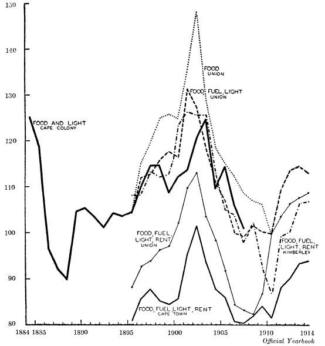

#Introduction

##Sentiment - Confidence and Uncertainty

##Art Price Indices

##Historical Commodity Prices

Create historical (high-frequency) monthly wholesale price indices for agricultural commodities in the Cape Colony

Data Revolution in African Economic History

1889-1914 interesting period 

- Discovery of gold in the Witwatersrand (1886) 
- Second South African War (1899-1902)
- Formation of the Union of South Africa (1910)
- Outbreak of WWI (1914)

#The Economic History of the Cape Colony

##Real GDP in the Cape Colony (1956-1909)
<!-- --> 

##Total Imports and Exports in the Cape Colony

<!-- --> 

#The Data

## Agricultural Journals: Total Observations

<!-- --> 

## Agricultural Journals: Monthly wheat prices by town

<!-- --> 

## Blue Books: Annual wheat prices by town

<!-- --> 

# Method

## Repeat Sales Method

$$\ln \frac{P_{it}}{P_{is}} = \sum_{t=1}^T \beta_t D_{it} + u_{it}$$

\begin{table}[ht]
\centering
\caption{Repeat sales example with wheat prices} 
\scalebox{0.7}{
\begin{tabular}{rrrrrr}
  \hline
Date & Period & Beaufort.West & Cape.Town & Worcester & Index \\ 
  \hline
    Jun 1891 &   1 & 150 &  & 210 & 100.00 \\ 
      Jul 1891 &   2 & 135 & 138 &  & 88.83 \\ 
      Aug 1891 &   3 & 135 & 150 &  & 92.01 \\ 
      Sep 1891 &   4 &  &  & 288 & 138.94 \\ 
      Oct 1891 &   5 &  & 144 &  & 86.37 \\ 
      Nov 1891 &   6 &  & 144 &  & 84.45 \\ 
      Dec 1891 &   7 & 120 & 144 &  & 82.57 \\ 
      Jan 1892 &   8 &  &  & 144 & 70.38 \\ 
      Feb 1892 &   9 &  & 126 & 144 & 71.31 \\ 
      Mar 1892 &  10 &  & 126 &  & 71.31 \\ 
   \hline
\end{tabular}
}
\end{table}

##Wheat indices for the Cape Colony

<!-- --> 

##Aggregating commodity indices

\begin{table}[ht]
\centering
\caption{Commodity classification} 
\scalebox{0.5}{
\begin{tabular}{lllllll}
  \hline
Crops & Agri.Produce & Pastoral.Products & Livestock & Pastoral.Provisions & Agri.Provisions & Other.Prov \\ 
  \hline
    Wheat &  Tobacco & Wool & Cattle & Beef & Bread & Tea \\ 
      Mealies & Dried Fruit & Hides & Horses Mules \& Asses & Mutton & Flour & Coffee \\ 
      Barley & Wine & Skins & Sheep & Pork & Mealie Meal & Sugar \\ 
      Oats & Brandy & Cheese & Pigs & Eggs & Boer Meal & Beer \\ 
      Oathay & 	 & Fat \& Tallow & Goats & Butter & Oatmeal & Rice \\ 
      Rye &   & Soap & Fowls \& Ducks & Milk &   & Salt \\ 
      Peas \& Beans &   & 	 &   &   &   & Candles \\ 
      Potatoes &   &   &   &   &   &  \\ 
   \hline
\end{tabular}
}
\end{table}

#Results 

##Commodity Indices

<!-- --> 

##Commodity Group Indices (1)

<!-- --> 

##Commodity Group Indices (2)

<!-- --> 

##Aggregate Commodity Index

<!-- --> 

##Comparisons: Cape retail price indices (1910=100)

##Comparisons: CPI

<!-- --> 

##Comparisons: UK Wholesale Prices

<!-- --> 

#Market Integration in the Cape Colony

##Regional Integration

<!-- --> 

##Pre-War Correlations

\begin{table}[ht]
\centering
\scalebox{0.6}{
\begin{tabular}{rllll}
  \hline
 & Cape Town & Port Elizabeth & East London & Kimberley \\ 
  \hline
Cape Town &  &  &  &  \\ 
  Port Elizabeth & \colorbox{cyan}{ 0.35***} &  &  &  \\ 
  East London & \colorbox{cyan}{ 0.27***} & -0.30*** &  &  \\ 
  Kimberley & \colorbox{cyan}{ 0.77***} & \colorbox{cyan}{ 0.38***} &  0.02  &  \\ 
  Worcester & \colorbox{cyan}{ 0.16** } & \colorbox{cyan}{ 0.38***} & -0.39*** & \colorbox{cyan}{ 0.38***} \\ 
  Malmesbury & \colorbox{cyan}{ 0.57***} & \colorbox{cyan}{ 0.51***} & \colorbox{cyan}{ 0.21** } & \colorbox{cyan}{ 0.68***} \\ 
  Beaufort West & \colorbox{cyan}{ 0.21** } & \colorbox{cyan}{ 0.66***} & -0.20**  & \colorbox{cyan}{ 0.32***} \\ 
  Mossel Bay & \colorbox{cyan}{ 0.34***} & \colorbox{cyan}{ 0.47***} & -0.33*** & \colorbox{cyan}{ 0.41***} \\ 
  Clanwilliam & -0.24**  & -0.51*** & \colorbox{cyan}{ 0.49***} & -0.13  \\ 
  Graham's Town & \colorbox{cyan}{ 0.54***} & \colorbox{cyan}{ 0.37***} & \colorbox{cyan}{ 0.20** } & \colorbox{cyan}{ 0.65***} \\ 
  Port Alfred &  0.13  & \colorbox{cyan}{ 0.41***} & -0.08  & \colorbox{cyan}{ 0.39***} \\ 
  Graaff-Reinet & \colorbox{cyan}{ 0.68***} & \colorbox{cyan}{ 0.39***} & -0.06  & \colorbox{cyan}{ 0.59***} \\ 
  Cradock & \colorbox{cyan}{ 0.24** } & \colorbox{cyan}{ 0.36***} &  0.05  & \colorbox{cyan}{ 0.51***} \\ 
  Colesberg & \colorbox{cyan}{ 0.40***} & \colorbox{cyan}{ 0.39***} &  0.10  & \colorbox{cyan}{ 0.59***} \\ 
  King William's Town & \colorbox{cyan}{ 0.61***} & \colorbox{cyan}{ 0.52***} &  0.05  & \colorbox{cyan}{ 0.66***} \\ 
  Queen's Town & \colorbox{cyan}{ 0.66***} & \colorbox{cyan}{ 0.45***} & -0.22**  & \colorbox{cyan}{ 0.50***} \\ 
  Burghersdorp & \colorbox{cyan}{ 0.53***} & \colorbox{cyan}{ 0.60***} & -0.25**  & \colorbox{cyan}{ 0.41***} \\ 
  Aliwal North & \colorbox{cyan}{ 0.76***} & \colorbox{cyan}{ 0.48***} &  0.13  & \colorbox{cyan}{ 0.58***} \\ 
  Dordrecht & \colorbox{cyan}{ 0.57***} & \colorbox{cyan}{ 0.31***} &  0.01  & \colorbox{cyan}{ 0.44***} \\ 
  Tarkastad & \colorbox{cyan}{ 0.48***} & \colorbox{cyan}{ 0.28***} & \colorbox{cyan}{ 0.42***} & \colorbox{cyan}{ 0.28***} \\ 
   \hline
\end{tabular}
}
\end{table}

##Post-War Correlations

\begin{table}[ht]
\centering
\scalebox{0.6}{
\begin{tabular}{rllll}
  \hline
 & Cape Town & Port Elizabeth & East London & Kimberley \\ 
  \hline
Cape Town &  &  &  &  \\ 
  Port Elizabeth & \colorbox{cyan}{ 0.34***} &  &  &  \\ 
  East London & \colorbox{cyan}{ 0.79***} & \colorbox{cyan}{ 0.32***} &  &  \\ 
  Kimberley & \colorbox{cyan}{ 0.72***} &  0.16*  & \colorbox{cyan}{ 0.52***} &  \\ 
  Worcester+ & \colorbox{cyan}{ 0.97***} & \colorbox{cyan}{ 0.47***} & \colorbox{cyan}{ 0.82***} & \colorbox{cyan}{ 0.67***} \\ 
  Malmesbury+ & \colorbox{cyan}{ 0.94***} & \colorbox{cyan}{ 0.54***} & \colorbox{cyan}{ 0.74***} & \colorbox{cyan}{ 0.55***} \\ 
  Beaufort West & \colorbox{cyan}{ 0.92***} & \colorbox{cyan}{ 0.43***} & \colorbox{cyan}{ 0.77***} & \colorbox{cyan}{ 0.64***} \\ 
  Mossel Bay+ & \colorbox{cyan}{ 0.80***} & \colorbox{cyan}{ 0.36***} & \colorbox{cyan}{ 0.87***} & \colorbox{cyan}{ 0.67***} \\ 
  Clanwilliam & \colorbox{cyan}{ 0.89***} & \colorbox{cyan}{ 0.37***} & \colorbox{cyan}{ 0.62***} & \colorbox{cyan}{ 0.50***} \\ 
  Graham's Town & \colorbox{cyan}{ 0.64***} & \colorbox{cyan}{ 0.73***} & \colorbox{cyan}{ 0.66***} & \colorbox{cyan}{ 0.36***} \\ 
  Port Alfred+ & \colorbox{cyan}{ 0.22** } & \colorbox{cyan}{ 0.30** } & \colorbox{cyan}{ 0.49***} &  0.12  \\ 
  Graaff-Reinet+ & \colorbox{cyan}{ 0.71***} & \colorbox{cyan}{ 0.43***} & \colorbox{cyan}{ 0.75***} & \colorbox{cyan}{ 0.70***} \\ 
  Cradock+ & \colorbox{cyan}{ 0.89***} & \colorbox{cyan}{ 0.58***} & \colorbox{cyan}{ 0.81***} & \colorbox{cyan}{ 0.46***} \\ 
  Colesberg+ & \colorbox{cyan}{ 0.80***} & \colorbox{cyan}{ 0.44***} & \colorbox{cyan}{ 0.91***} & \colorbox{cyan}{ 0.43***} \\ 
  King William's Town & \colorbox{cyan}{ 0.79***} & \colorbox{cyan}{ 0.65***} & \colorbox{cyan}{ 0.67***} & \colorbox{cyan}{ 0.50***} \\ 
  Queen's Town & \colorbox{cyan}{ 0.35***} & \colorbox{cyan}{ 0.46***} & \colorbox{cyan}{ 0.53***} & -0.03  \\ 
  Burghersdorp & \colorbox{cyan}{ 0.51***} &  0.14  & \colorbox{cyan}{ 0.49***} & \colorbox{cyan}{ 0.68***} \\ 
  Aliwal North & \colorbox{cyan}{ 0.70***} & \colorbox{cyan}{ 0.56***} & \colorbox{cyan}{ 0.70***} & \colorbox{cyan}{ 0.46***} \\ 
  Dordrecht+ & \colorbox{cyan}{ 0.67***} & \colorbox{cyan}{ 0.40***} & \colorbox{cyan}{ 0.81***} & \colorbox{cyan}{ 0.51***} \\ 
  Tarkastad+ & \colorbox{cyan}{ 0.73***} & \colorbox{cyan}{ 0.34***} & \colorbox{cyan}{ 0.87***} & \colorbox{cyan}{ 0.71***} \\ 
   \hline 
 \multicolumn{4}{l}{\scriptsize{Notes: + indicates restricted sample (Dec 1910)}} 
\end{tabular}
}
\end{table}

##Unit Root Tests - relative to Cape Town

\begin{table}[ht]
\centering
\scalebox{0.6}{
\begin{tabular}{rlll}
  \hline
 & Pre-War & Post-War & Full Period \\ 
  \hline
Port Elizabeth & -1.68  & -2.17  & -2.57  \\ 
  East London & -2.75  & -1.48  & -3.22*  \\ 
  Kimberley & -3.22*  & -2.54  & -2.76  \\ 
  Worcester+ & -3.16*  & -4.05**  & -3.79**  \\ 
  Malmesbury+ & -2.45  & -3.37*  & -2.67  \\ 
  Beaufort West & -1.99  & -2.45  & -2.96  \\ 
  Mossel Bay+ & -2.22  & -3.30*  & -2.66  \\ 
  Clanwilliam &  1.96  & -3.54**  & -2.22  \\ 
  Graham's Town & -2.12  & -3.16*  & -3.85**  \\ 
  Port Alfred+ & -0.80  & -3.27*  & -2.55  \\ 
  Graaff-Reinet+ & -3.26*  & -2.66  & -4.42**  \\ 
  Cradock+ & -1.45  & -2.12  & -2.82  \\ 
  Colesberg+ & -2.67  & -2.31  & -2.92  \\ 
  King William's Town & -2.29  & -3.96**  & -3.09  \\ 
  Queen's Town & -0.07  & -2.43  & -1.95  \\ 
  Burghersdorp & -3.32*  & -2.61  & -2.64  \\ 
  Aliwal North & -3.28*  & -3.78**  & -4.17**  \\ 
  Dordrecht+ & -2.50  & -2.12  & -3.11  \\ 
  Tarkastad+ & -2.77  & -2.82  & -2.80  \\ 
   \hline 
 \multicolumn{4}{l}{\scriptsize{Notes: + indicates restricted sample (Dec 1910)}} 
\end{tabular}
}
\end{table}

## Suggestions and Advice?

